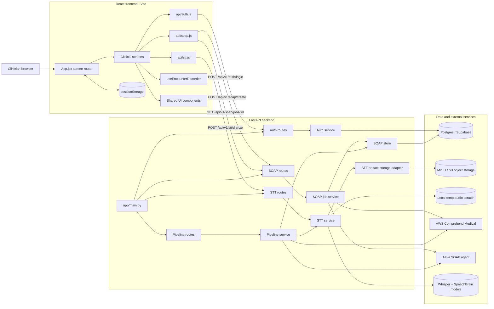
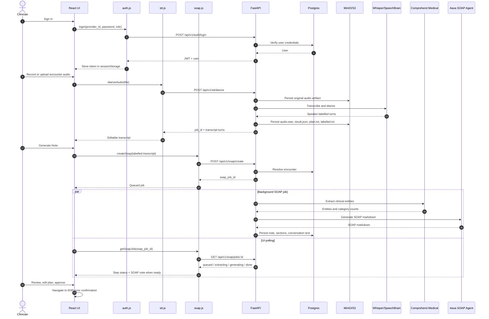
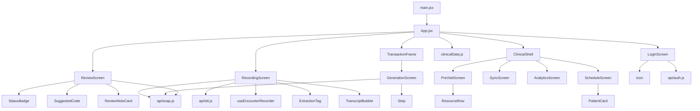

# DocConnect Architecture

## System Overview

## Encounter To SOAP Sequence

## Frontend Component Structure

## Runtime Notes

- Frontend dev server runs on port `10100`.
- Backend API is expected on port `10200`.
- Vite proxies `/api` to the backend during dev.
- Login is normally database-backed through the `users` table.
- The current local frontend includes a demo fallback for `DR-SMITH` / `Smith#2026` when the backend cannot be reached.
- SOAP generation depends on AWS credentials and `AAVA_JWT_TOKEN`.
- STT can run locally with Whisper/SpeechBrain or proxy to the standalone `sst_v1` service in remote mode.
- Persisted encounter audio and transcript artifacts can be stored in MinIO through the S3-compatible object storage adapter by setting `OBJECT_STORAGE_PROVIDER=minio`.
- The local STT engine still uses temporary local files for ffmpeg, Whisper, and SpeechBrain, then uploads durable artifacts to object storage.
- MinIO stores PHI-heavy artifacts while Postgres keeps relational encounter/note metadata and object keys.
