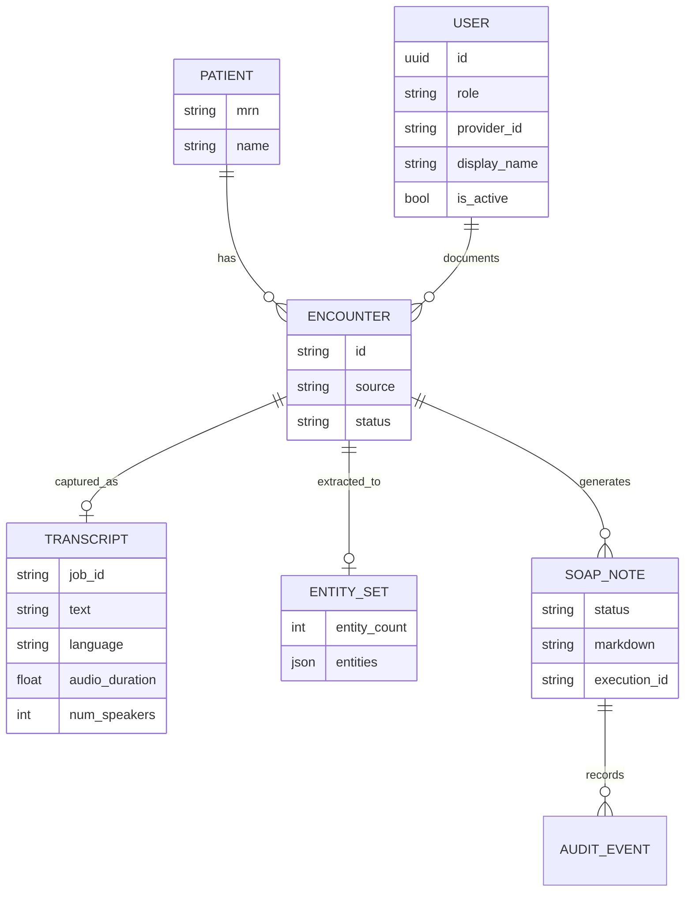
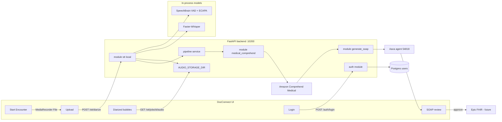

# Feature Specification: Record or Upload Conversation, Generate Transcript, Generate SOAP

**Product:** Outpatient System (DocConnect)  
**Classification:** Production-intent clinical documentation feature  
**Document type:** Complete feature specification (Parts A–G)

Related API contracts: `backend/docs/STT_DIARIZATION_API.md` (capture), `soap_create/API.md` (SOAP create). Recording-screen wiring: Appendix D. SOAP create wiring: Appendix E.

---

# PART A — PRODUCT & BUSINESS

# 3. Document Information

**Classification:** Mandatory

## 3.1 Feature Name

Record or Upload Conversation, Generate Transcript, and Generate SOAP Note

## 3.2 Feature ID

`CLINICAL-FEAT-001`

Related capability IDs:

| ID | Capability |
|---|---|
| `CLINICAL-FEAT-001a` | Record live encounter or upload conversation audio |
| `CLINICAL-FEAT-001b` | Generate encounter transcript |
| `CLINICAL-FEAT-001c` | Extract clinical entities and generate SOAP draft |

## 3.3 Version

`v1.2`

## 3.4 Status

**Development**

Current codebase state:

- Frontend (`frontend/`, `praj_ui/`) is a clickable DocConnect prototype. Login is wired to the backend auth API. The **Live Encounter** screen (`/?screen=recording`) is wired to in-process diarization: upload a file or record from the microphone, then render speaker-labelled bubbles with per-turn playback and inline edit. **Generate Note** starts `POST /api/v1/soap/create`; the generation screen polls the job; review renders the returned S/O/A/P sections. Schedule patients still use mock clinical data.
- Speech-to-text now runs **in the unified backend** (`STT_ENGINE_MODE=local`): SpeechBrain diarization + Faster-Whisper transcription, with local job storage under `backend/data/audio/`. The standalone evaluation service (`sst_v1/`) remains as a fallback (`STT_ENGINE_MODE=remote`) and as the source of the two-party test fixture.
- SOAP generation (`soap_create/` prototype scripts, live in `backend/app/modules/medical_comprehend` + `generate_soap`): Amazon Comprehend Medical → Aava agent 54818 → parsed S/O/A/P persisted to Postgres. UI path is the pollable `POST /api/v1/soap/create` job.
- Unified FastAPI backend (`backend/`) exposes `/api/v1/auth`, `/api/v1/stt/*` (transcribe, diarize, jobs, audio), comprehend, SOAP, and pipeline.

## 3.5 Owner

Outpatient System engineering team. Prototype owners visible in the repo:

- Product UI: DocConnect React screens
- STT / diarization: `backend/app/modules/stt` (in-process); evaluation harness in `sst_v1`
- SOAP pipeline: `soap_create` (Aman Prakash / Nitor Infotech)

## 3.6 Last Updated

27 August 2026

---

# 4. Feature Overview

**Classification:** Mandatory

## 4.1 Summary

This feature lets a clinician capture an outpatient encounter by recording it live or uploading an audio file, convert that conversation into a transcript, extract clinical entities, and draft a SOAP note for human review.

It reduces after-visit documentation time. The clinician still owns the medical record: generated notes stay drafts until the clinician edits, accepts, and approves them.

The implemented pipeline is:

```text
Audio (mic record or file upload)
  → POST /api/v1/stt/diarize
  → speaker-labelled turns + stored 16 kHz WAV
  → Generate Note (edited Doctor:/Patient: transcript)
  → POST /api/v1/soap/create
  → Comprehend Medical DetectEntitiesV2
  → Aava agent 54818
  → parse S/O/A/P → soap_notes / soap_note_sections
  → clinician review
```

Capture and diarized transcript are wired end-to-end on the recording screen. **Generate Note** sends the edited labelled transcript to `/api/v1/soap/create` (Comprehend Medical → Aava → Postgres SOAP sections). The generation and review screens bind to that job.

---

# 5. Problem / Opportunity

**Classification:** Mandatory

**Current problem.** Clinicians spend a large share of each visit writing notes after the conversation. Live typing during the visit splits attention. Writing later from memory loses detail.

**Who experiences it.** Physicians (primary), medical assistants who help close charts, and clinic administrators who track documentation lag.

**Current workaround.** Handwritten or EHR-typed notes, memory, and (in this prototype) disconnected tools: a mock UI, a separate Whisper STT service, and a local SOAP script that is not wired to the UI.

**Business impact.** Documentation delay, incomplete charts, slower billing/coding, and reduced visit capacity.

**User impact.** After-hours charting, missed symptoms or meds, and inconsistent SOAP structure.

**Why this feature is needed.** The conversation already contains the note. The system should capture it, structure it, and present a reviewable draft instead of asking the clinician to recreate it.

---

# 6. Goals & Success Criteria

**Classification:** Mandatory

## 6.1 Primary Goal

Produce a reviewable SOAP draft from a live or uploaded encounter conversation with less manual writing.

## 6.2 Secondary Goals

- Capture the encounter without requiring the clinician to type during the visit.
- Keep a timestamped transcript as the source of truth next to the draft.
- Extract symptoms, medications, tests, and PHI so the SOAP agent is grounded in detected entities.
- Keep the clinician in the loop for edit, accept, and approve.
- Surface generation progress clearly (transcribe → extract → generate).

## 6.3 Success Metrics

Targets taken from the DocConnect analytics prototype and STT team report. Current production values are not yet measured.

| Metric | Current | Target |
|---|---:|---:|
| Average documentation time | ~15 min (assumed baseline) | <5 min, prototype shows 4.2 min saved / encounter |
| Draft completion rate | Prototype only | >90% of ended encounters produce a draft |
| User acceptance rate | Prototype KPI 94% | >80% of drafts accepted with minor or no edits |
| Critical missing-information rate | Not measured | <2% |
| STT real-time factor (local `small.en`, GPU) | ~0.1 on 47 s two-party fixture | RTF < 1.0 for typical outpatient audio |
| SOAP section completeness | Sample note contains S/O/A/P | >98% of drafts include all four SOAP sections |

---

# 7. Target Users

**Classification:** Mandatory

**Primary user:** Physician (DocConnect role `Physician`, example user Dr. Smith, Cardiology).

**Secondary user:** Medical assistant who may start recording, flag moments, or prepare the pre-visit chart.

**Administrator:** Clinic/hospital admin (`Admin` login role) who views analytics, EHR sync status, and documentation completeness.

**Indirect stakeholders:** Coding/billing (suggested ICD-10 codes), EHR (Epic FHIR write), compliance/privacy officers.

---

# 8. Scope & Non-Goals

**Classification:** Mandatory

## 8.1 In Scope

- Sign in to the clinical workspace with role + Provider ID + password (checked against `users`; JWT stored in `sessionStorage`). Hospital SSO remains a non-working placeholder.
- Open a scheduled encounter and view pre-visit context (complaint, allergies, labs, meds).
- Start a live ambient recording (getUserMedia + MediaRecorder). The full file is submitted on **End Encounter** — there is no mid-recording transcript refresh in this slice.
- Upload a recorded conversation from the same screen (WAV, MP3, M4A, WebM, FLAC, OGG, Opus, AAC, and related formats). Both paths call `POST /api/v1/stt/diarize`.
- Show speaker-labelled transcript bubbles after processing, with per-turn Play (seek into the stored WAV) and inline Edit (React state only).
- Swap anonymous diarization clusters between clinician and patient when the default assignment is wrong.
- Generate a full transcript with timed speaker turns, language, RTF metrics, and a retrievable `job_id`.
- Extract clinical entities with Amazon Comprehend Medical `DetectEntitiesV2`.
- Generate a SOAP markdown draft through the configured Aava agent (`agentId` `54818`).
- Review, edit, accept, save as draft, or approve & sync.
- Show EHR sync confirmation for Encounter / Condition / MedicationRequest resources (prototype).
- Show analytics KPIs for time saved, acceptance, completeness, and coding accuracy (prototype).

## 8.2 Out of Scope / Non-Goals

- Automatic prescription or order placement without clinician action.
- Finalizing a note without clinician approval.
- Independent clinical decision-making or diagnosis confirmation.
- Replacing the EHR chart as the system of record.
- Real word-by-word ASR, or pseudo-live chunked refresh while recording (deferred; End Encounter / Upload send one complete file).
- Pause during a live recording (the idle/recording/processing/ready machine has no pause state).
- Persisting bubble edits back to the server (edits live in React state until the next submit).
- Identifying which cluster is the clinician automatically (cluster ids are anonymous; the UI defaults first-to-speak → clinician and offers **Swap speakers**).
- JWT gating on STT/SOAP routes (still open; matching login).
- Production Epic FHIR integration (UI shows success; no live FHIR client exists yet).
- Hospital SSO and multi-tenant IAM beyond Provider ID + password login.
- Automated coding claim submission.
- Patient-facing portal.

---

# 9. User Stories

**Classification:** Optional

> As a **physician**, I want to **sign in with my Provider ID and password**, so that **only my account can open the clinical workspace**.

> As a **physician**, I want to **record the visit without typing**, so that **I can look at the patient**.

> As a **physician**, I want to **upload a recorded conversation**, so that **I can generate a note from visits captured on another device**.

> As a **physician**, I want **a transcript of the conversation split by speaker**, so that **I can verify wording before I sign the note**.

> As a **physician**, I want to **play back one turn** and **edit its text**, so that **I can correct the transcript without re-recording**.

> As a **physician**, I want to **swap speaker labels**, so that **the clinician stays on the right when diarization guesses wrong**.

> As a **physician**, I want the system to **draft a SOAP note from the transcript**, so that **I spend less time writing documentation**.

> As a **physician**, I want to **edit the generated note before approval**, so that **I remain responsible for the medical record**.

> As a **clinic admin**, I want to **see documentation time and acceptance**, so that **I know whether the assistant is helping**.

---

# 10. Functional Description / How It Works

**Classification:** Mandatory

## 10.1 Entry Point

The clinician opens `/` (login), selects Physician or Admin, enters Provider ID and password, and signs in. On success the UI stores a Bearer JWT and opens **Today's Schedule** (`/?screen=schedule`). The clinician then selects a patient, reviews the **Pre-Visit Dashboard**, and chooses **Start Encounter**.

Alternatively, on the Live Encounter screen the clinician can click **Upload** and pick a local audio file. Both the mic path (after **End Encounter**) and the upload path POST the complete file to `/api/v1/stt/diarize`. There is no dedicated upload-only screen.

## 10.2 Input

- Live microphone audio (MediaRecorder WebM/Opus, or MP4/AAC on Safari), or an uploaded audio file.
- Optional language hint. Speaker count defaults to 2 (outpatient two-party). The UI does not currently send `num_speakers`; the backend default applies.
- Encounter / patient context already visible in the UI (name, MRN, meds, allergies, labs). This context is **not** yet automatically merged into the SOAP agent call, and is **not** sent with the diarize request.
- For SOAP-only replay: transcript text or a previously saved `entities.json`.

## 10.3 Processing

1. **Capture.** The clinician either starts the microphone (`getUserMedia` + `MediaRecorder`) and stops it, or picks a local file. Both produce one `File`.
2. **Transcribe + diarize.** `POST /api/v1/stt/diarize` validates, converts to 16 kHz mono WAV, runs SpeechBrain (who spoke when) and Faster-Whisper (what was said), and aligns words to speakers. Response is `turns[]` plus a `job_id`.
3. **Present transcript.** The recording screen replaces the empty state with one bubble per turn. Play seeks the stored WAV; Edit updates local state. **Swap speakers** flips clinician/patient styling.
4. **Extract.** `POST /api/v1/soap/create` runs Amazon Comprehend Medical `DetectEntitiesV2` on the **edited** labelled transcript (`Doctor:` / `Patient:` lines from the bubbles, not the stored STT `result.json`).
5. **Generate.** The same job submits those entities to Aava agent `54818`, parses the markdown into Subjective / Objective / Assessment / Plan, upserts `soap_notes` + `soap_note_sections`, and the generation screen polls until `done`. **Review Draft Note** opens the review screen with those four sections.

## 10.4 User Review

The draft appears as **Needs physician review**. The clinician can toggle the source transcript on Subjective, read Objective and Assessment, edit Plan, Accept, regenerate (new `/soap/create` job), save as draft, or **Approve & Sync**. Suggested ICD-10 codes remain mock.

## 10.5 Final Result

On approve, the prototype shows an EHR sync success screen. In the target backend, the approved markdown and entity snapshot remain stored against the encounter. No note is treated as signed until that explicit approval.

---

# 11. Acceptance Criteria

**Classification:** Mandatory

- Given a valid audio upload on the recording screen, the user receives speaker-labelled bubbles (`turns[]` with `speaker_id`, `start`, `end`, `text`).
- Given a microphone recording, **End Encounter** submits the complete file to the same `/diarize` endpoint and the same bubbles appear.
- Given a stored `job_id`, **Play** on a bubble seeks the converted WAV to that turn's `start` and pauses at `end`.
- Given **Edit**, the clinician can change a bubble's text in the UI; Cancel / Escape restore the previous wording. Edits are not persisted server-side in this slice.
- Given two or more speakers, **Swap speakers** reassigns clinician vs patient styling without another API call.
- Given a valid transcript, **Generate Note** starts `POST /api/v1/soap/create` and the generation screen polls until `done` or `failed`.
- Given a completed job, review shows four sections: Subjective, Objective, Assessment, Plan (Plan editable).
- Given a valid transcript, the user can extract Comprehend Medical entities (also available as `POST /api/v1/comprehend/entities`).
- Given entities, the user can generate a SOAP draft containing Subjective, Objective, Assessment, and Plan headings (`/soap/create` or `/soap/generate`).
- Generated content is shown as a draft, not as an approved record.
- The user can edit the draft before approval.
- Empty audio, empty transcript, or empty entity payload is rejected with a 4xx error.
- If STT, AWS, or Aava is unavailable, the API returns a clear 502/503/504 and the original transcript is not marked approved.
- Given valid Provider ID, password, and matching role, the user receives a JWT and is taken to `/?screen=schedule`.
- Given unknown id, bad password, inactive user, or role mismatch, login stays on `/` and shows `invalid_credentials` (same message; no user enumeration).
- Unauthorized production users must not access another clinician's encounter (RBAC is specified in §29; STT/SOAP routes are not yet JWT-gated).
- A note cannot be finalized without the Approve action.

---

# 12. Priority

**Classification:** Mandatory

**Priority: P0 / Must Have** for the three-step documentation path (record/upload → transcript → SOAP).

| Item | Priority |
|---|---|
| Live record + upload STT | P0 |
| Speaker diarization (two-party default) | P0 |
| Per-turn playback of stored audio | P0 |
| Transcript persistence with the encounter | P0 |
| Entity extraction | P0 |
| SOAP draft generation | P0 |
| Clinician edit + approve | P0 |
| Provider ID + password login (JWT) | P0 |
| EHR FHIR write | P1 |
| Suggested ICD-10 coding | P1 |
| Analytics dashboard | P1 |
| Live extraction tags during recording | P1 (still mock on the recording screen) |
| Faster-Whisper / GPU engine | P0 (in-process default; CPU fallback) |
| Pseudo-live chunked transcript while recording | P2 |
| Persist bubble edits to the job result | P2 |
| Patient instruction handout | P2 |

---

# 13. Assumptions

**Classification:** Optional

- The clinician signs in with a seeded or provisioned `users` row (prototype login no longer always succeeds).
- Hospital SSO is not available in this slice.
- Patient consent for ambient recording is obtained outside this feature.
- `STT_ENGINE_MODE=local` and the optional `stt` extra (torch, speechbrain, faster-whisper) are installed on the runtime that serves `/api/v1/stt/diarize`.
- ffmpeg / ffprobe are on PATH (the backend Dockerfile installs them).
- `sst_v1` is only required when `STT_ENGINE_MODE=remote`. Live WebSocket transcription is remote-mode only.
- Outpatient encounters are two-party unless the caller overrides `num_speakers`. Automatic speaker-count estimation is less reliable than supplying the count.
- AWS credentials can call Comprehend Medical in the configured region.
- `AAVA_JWT_TOKEN` can execute agent `54818`.
- Python 3.11 is required for `sst_v1` Whisper dependencies; the unified backend also targets 3.11+.
- After login, the frontend still uses mock patients (`Marcus Thorne` / `Marcus Johnson`) for schedule and encounter screens. Recording now calls the backend; those other screens do not.

---

# 14. Dependencies

**Classification:** Mandatory

| Dependency | Role |
|---|---|
| DocConnect React UI | Capture, generation, review screens |
| `backend/app/modules/stt` | In-process SpeechBrain diarization + Faster-Whisper STT (default) |
| `sst_v1` FastAPI | Legacy / evaluation STT; used only when `STT_ENGINE_MODE=remote` |
| ffmpeg / ffprobe | Convert uploads to 16 kHz mono WAV; duration probe |
| SpeechBrain | VAD (CRDNN) + ECAPA-TDNN embeddings + spectral clustering |
| Faster-Whisper / openai-whisper | Word-level transcription |
| Amazon Comprehend Medical | `DetectEntitiesV2` |
| Aava agent platform | SOAP markdown generation |
| AWS IAM credentials | Comprehend access |
| Aava JWT | Agent execute + history |
| PyTorch | Local STT/diarization device |
| Future EHR (Epic FHIR) | Persist approved note |

---

# 15. Cross-Feature Dependencies & Conflicts

**Classification:** Optional

| Feature | Relationship | Conflict | Resolution |
|---|---|---|---|
| Pre-visit chart | Supplies meds, allergies, labs | SOAP agent currently receives entities only, not the chart | Pass selected chart context into `userInputs` in a later version |
| Suggested coding | Uses assessment text | Codes in the UI are mocked | Derive codes from Comprehend + clinician confirmation |
| EHR sync | Consumes approved SOAP | Sync screen is simulated | Do not mark synced unless FHIR write succeeds |
| Transcript edit | Source for SOAP | Bubble edits are local React state; SOAP still sees the original stored result | Persist edits to the job, then mark SOAP as `stale` and require regenerate |
| Analytics | Reads generation outcomes | Currently hardcoded KPIs | Emit product events from the backend |

---

# 16. Risks & Open Questions

**Classification:** Mandatory

## 16.1 Known Risks

- Clinical facts can be omitted or hallucinated in the SOAP draft.
- Overlapping speakers and similar voices degrade diarization. Cluster ids (`speaker_0`, `speaker_1`) are anonymous and unordered — the UI cannot know which is the clinician.
- Whisper live streaming is not available in `local` mode; the recording screen submits the complete file after End Encounter. Overlapping speech still degrades word timestamps.
- Comprehend Medical can mis-tag hypothetical or negated findings (the sample run tagged several hypothetical warning signs).
- PHI (name, age, address) lives in stored WAVs under `AUDIO_STORAGE_DIR` and is sent to AWS and Aava once SOAP is generated.
- Job lookups interpolate `job_id` into a glob; ids must be 32 hex characters or a `*` would match another patient's directory.
- Aava execute API is sensitive to field names (`Files` vs `files`) and MIME type (`text/plain`).
- `whisperflow` cannot be installed beside FastAPI ≥ 0.111.
- Login is wired; recording is wired to `/diarize`. Generation and review are wired to `/soap/create`. Schedule patients still use mock data.

## 16.2 Open Questions

- Should a previous approved SOAP remain visible after regeneration?
- Should live extraction tags come from Comprehend in real time, or only after the encounter ends?
- Should bubble edits PATCH the stored `result.json`, or only feed SOAP?
- Which chart fields (allergies, active meds) must be injected into the SOAP agent?
- What is the retention period for audio versus transcript versus entities? Local disk today has no automatic expiry.
- Will production STT stay on-box SpeechBrain + Whisper, or move to a managed ASR?
- When should pseudo-live chunked refresh land relative to SOAP wiring?

## 16.3 Mitigation

- Require clinician approval before any EHR write.
- Keep the transcript next to the draft for verification.
- Fail closed: do not store an approved note if generation fails.
- Redact or minimize PHI in logs.
- Pin Aava protocol details in `generate_soap/agent_call.py`.

---

# 17. Edge Cases

**Classification:** Mandatory

| Edge case | Expected behaviour |
|---|---|
| Empty audio / silent file | STT returns empty text; pipeline rejects SOAP generation |
| Very short transcript | Entities may be empty; SOAP endpoint returns 400 |
| Very long transcript | Comprehend input is chunked at 20,000 characters; overall cap is `MAX_TRANSCRIPT_CHARS` |
| Multiple speakers | Local engine diarizes (default 2). UI shows one bubble per turn. Cluster numbering is arbitrary; **Swap speakers** reassigns clinician/patient. Overlap still mixes words |
| Unsupported language | Whisper auto-detects; SOAP English quality may drop. Surface detected `language` |
| Unsupported audio type | Backend `validate_upload` returns 400 with allowed extensions; the UI pre-checks the same list |
| Duplicate submission | New encounter artifact is created; previous draft is not overwritten until versioning is added |
| User closes browser during generation | Backend job (Aava poll) may still finish; UI must allow resume by `encounter_id` (in-memory store is lost on process restart in v1) |
| STT extra not installed | `/api/v1/stt/engine` reports `dependencies_available: false`; `/diarize` returns 503 with install instructions (not a 500) |
| STT unavailable (remote mode) | `/api/v1/ready` reports STT unavailable; transcribe returns 502 |
| Mic permission denied | Friendly message; session stays idle; Upload remains available |
| Empty MediaRecorder blob | Friendly error; no `/diarize` call |
| Job audio missing (`save_audio=false` or unknown id) | Play is disabled (`canPlay` requires `job_id`); `GET /jobs/{id}/audio` returns 404 |
| AWS unavailable | Entity extraction returns 502; transcript is kept |
| Aava unavailable or non-success status | SOAP returns 502; entities are kept |
| Previous note already approved | UI still allows review; production must block silent overwrite (not yet implemented) |
| Audio over size/duration limit | 400 from STT (`MAX_AUDIO_SIZE_MB`, `MAX_AUDIO_DURATION_SECONDS`) |

---

# 18. Stakeholders & Ownership

**Classification:** Optional

| Area | Owner |
|---|---|
| Product | Product Manager |
| UX | DocConnect UI (`frontend/`, `praj_ui/`) |
| Backend | `backend/` FastAPI |
| STT / diarization | `backend/app/modules/stt` (in-process); `sst_v1/` evaluation |
| SOAP / AI | `soap_create/` + `backend/app/modules/generate_soap` |
| QA | pytest suites in `backend/tests` (including `test_stt_diarization.py` and `test_stt_real_model.py`) and `sst_v1/tests` |
| Security | Security / compliance review before PHI production use |
| EHR | Future Epic/FHIR owner |

---

# 19. Timeline / Milestones

**Classification:** Optional

| Milestone | Target | Status |
|---|---|---|
| STT evaluation service | Existing | Done (`sst_v1`, 76 tests) |
| SOAP script (Comprehend + Aava) | Existing | Done (`soap_create`) |
| Clickable UI prototype | Existing | Done (`frontend`) |
| Unified backend modules | Week of 21 Aug 2026 | Done |
| Provider ID login + JWT (`/api/v1/auth`) | 21 Aug 2026 | Done (`frontend` login → `users` table) |
| In-process STT + diarization (`/diarize`, jobs, audio) | 26–27 Aug 2026 | Done |
| Wire recording screen to `/diarize` | 27 Aug 2026 | Done (upload + mic; Play / Edit / Swap) |
| Wire generation / review screens to SOAP | 27 Aug 2026 | Done (`/soap/create` job + S/O/A/P review) |
| Wire remaining UI screens to backend | Next | Recording, generation, and review done; schedule still mock |
| RBAC on STT/SOAP routes; idle lock | Next | Not started |
| Staging with real encounters | TBD | Not started |
| Production | TBD | Not started |

---

# PART B — USER EXPERIENCE

# 20. UX Flow Journal

**Classification:** Conditional — Mandatory for user-facing features

### Step 1 — Sign in

**Screen:** Login (`login`, path `/`)  
**User goal:** Enter the clinical workspace.  
**User action:** Choose Physician or Admin, enter Provider ID and password, click Sign In. Hospital SSO is visible but not wired.  
**System response:** `POST /api/v1/auth/login`. On `ok`, stores JWT in `sessionStorage` (`docconnect_token`) and navigates to `/?screen=schedule`.  
**User expectation:** Secure login, HIPAA session warning visible.  
**Failure behaviour:** Dismissible error pop on the login card (`role="alert"`). Same copy for unknown id, bad password, inactive user, or role mismatch. Network errors stay on `/` with a connection message. Opening `?screen=` without a token bounces to login.  
**Next step:** Schedule.

### Step 2 — Choose encounter

**Screen:** Today's Schedule (`schedule`)  
**User goal:** Open the next patient.  
**User action:** Filter All Today / Needs Review / Synced; click a patient card. First card goes to pre-visit; others go to review.  
**System response:** Shows queue, urgent-review banner, clinic-flow and EHR-sync side panel.  
**Failure behaviour:** Empty schedule should show an empty state (not yet distinct).  
**Next step:** Pre-visit or review.

### Step 3 — Pre-visit briefing

**Screen:** Pre-Visit Dashboard (`previsit`)  
**User goal:** Confirm identity, complaint, allergies, labs, meds.  
**User action:** Read chart; click **Start Encounter**.  
**System response:** Opens live recording.  
**User expectation:** Safety flags (penicillin anaphylaxis, abnormal HbA1c) are obvious.  
**Next step:** Recording.

### Step 4 — Record conversation

**Screen:** Live Encounter (`recording`, `/?screen=recording`)  
**User goal:** Capture the visit as a diarized transcript.  
**User action:** Click **Start Encounter** (mic) or **Upload** (local file). While recording, the button becomes **End Encounter**. Optionally Flag Moment (still mock). After bubbles appear, Play / Edit each turn, **Swap speakers** if the clinician is on the wrong side, then **Generate Note**.  
**System response:**
- Status machine: `idle → recording → processing → ready` (plus `error`).
- Timer starts at `00:00` and only ticks while `recording`.
- Both capture paths call `submitAudio` → `POST /api/v1/stt/diarize` (multipart, abortable).
- `processing` shows the typing-bubble spinner and disables Start / Upload.
- On success, one `TranscriptBubble` per `turns[]` item, a hidden `<audio>` sourced from `GET /api/v1/stt/jobs/{job_id}/audio`, and **Generate Note**.
**User expectation:** Transcript appears after the encounter ends or the file is processed — not while talking. Play replays only that turn. Edit does not require a round-trip.  
**Failure behaviour:** Mic permission denied → blocking message, stay idle, Upload still available. Oversized / wrong-type file fails instantly in the client (50 MB / supported extensions). Backend 4xx/5xx and network errors show a dismissible `.transcript-error`. Cancel aborts the in-flight `/diarize`.  
**Exit point:** **Generate Note** → generation screen, or back to schedule. **End Encounter no longer navigates away**; it transcribes first.  
**Next step:** Generation (`POST /api/v1/soap/create`, Appendix E).

### Step 4b — Upload conversation (same screen)

**Screen:** Live Encounter, **Upload** button to the right of Start / End Encounter. Hidden `<input type="file" accept="audio/*,.webm,.m4a,.opus">`.  
**User goal:** Process a recording made elsewhere.  
**User action:** Pick a local audio file. Disabled while `recording` or `processing`.  
**System response:** Same `submitAudio` / `/diarize` path as End Encounter.  
**Failure behaviour:** Invalid file 400; missing STT extra 503; STT down 502. Client pre-check for empty, >50 MB, unsupported extension.  
**Next step:** Same as Step 4 (bubbles, then Generate Note).

### Step 5 — Generate transcript and SOAP

**Screen:** AI Note Generation (`generation`)  
**User goal:** Wait for the draft.  
**User action:** Wait, or Cancel Processing back to recording.  
**System response:** Steps: Transcribing → Extracting Clinical Entities → Generating Note, bound to `GET /api/v1/soap/jobs/{id}`. Transcribing is already done (recording screen). **Generate Note** submits `POST /api/v1/soap/create` with the edited labelled transcript, then navigates here.  
**User expectation:** 30–60 seconds for SOAP, progress visible, original recording not lost (`job_id` already stored).  
**Failure behaviour:** Retry + keep transcript.  
**Next step:** Review.

### Step 6 — Review SOAP

**Screen:** Clinical History / SOAP Review (`review`)  
**User goal:** Correct and accept the draft.  
**User action:** Read Subjective and Assessment, edit Plan, Accept, optional regenerate, Save as Draft, or Approve & Sync.  
**System response:** `Needs physician review` badge; suggested ICD-10 rail.  
**User expectation:** Transcript available from the Subjective card; edits are kept.  
**Failure behaviour:** Validation warnings stay visible until acknowledged.  
**Next step:** Sync or schedule.

### Step 7 — Approve and sync

**Screen:** EHR Sync Status (`sync`)  
**User goal:** Confirm the note reached the chart.  
**User action:** Back to Schedule or View Patient Instructions.  
**System response:** Success mark and FHIR resource list.  
**Failure behaviour:** Production must show partial FHIR failures per resource.  
**Next step:** Schedule.

### Step 8 — Analytics (optional)

**Screen:** Clinical Impact Dashboard (`analytics`)  
**User goal:** See whether the assistant is helping.  
**User action:** View KPIs and accuracy by SOAP section.  
**Next step:** Return to schedule.

---

# 21. UI Screen Specification

**Classification:** Conditional — Mandatory when UI exists

Shared chrome: collapsible sidebar (`AppSidebar`), top bar, mobile bottom nav. Font: Inter. Primary: `#00478d`.

## 21.A Login

**Purpose:** Authenticate and choose role.  
**Components:** Brand mark, role segment (Physician / Admin), SSO placeholder, Provider ID, password, HIPAA note, dismissible error pop.  
**Actions:** Sign In → `POST /api/v1/auth/login` → schedule on success. SSO does nothing.  
**States:** Initial, loading (Sign In disabled), error (alert on the card).

## 21.B Schedule

**Purpose:** Patient queue for the day.  
**Components:** Filters, urgent banner, `PatientCard` list, clinic-flow / EHR / AI-queue cards.  
**Actions:** Open pre-visit or review.  
**States:** Mock populated list; no empty/error.

## 21.C Pre-Visit Dashboard

**Purpose:** Safety and visit focus before recording.  
**Components:** Avatar, chief complaint, allergies, labs, medications, PMH, safety flags.  
**Primary action:** Start Encounter.  
**States:** Static mock data.

## 21.D Live Encounter / Recording

**Purpose:** Capture the conversation and show a diarized transcript.  
**Route:** `/?screen=recording` — `frontend/src/screens/RecordingScreen.jsx`.  
**Layout:** Desktop three columns — patient/timer, transcript, live extraction. Footer: Start/End Encounter + Upload (+ Generate Note once ready).  
**Components:**
- `record-timer` (`aria-live="polite"`). Class `idle` when not recording (no red pulse).
- `TranscriptBubble` — speaker label, optional clock, body, icon-only Play / Edit (`aria-label`s).
- Turn editor — `<textarea>`, Save / Cancel, Escape restores original, Ctrl/Cmd+Enter saves.
- Shared hidden `<audio>` for all Play actions (seek `turn.start`, pause at `turn.end`).
- `speaker-swap` row when more than one speaker is detected.
- `transcript-empty` / `transcript-processing` / `transcript-error`.
- `ExtractionTag` rail (still mock: chest tightness, Lisinopril, 3 days ago).
- Flag Moment (still mock).

**Actions:**

| Control | Behaviour |
|---|---|
| Start Encounter | `useEncounterRecorder.start()` → `status=recording`. Icon `mic`, class `button-primary`. Disabled while processing or if MediaRecorder has no supported type. |
| End Encounter | Stop tracks, collect `File`, `submitAudio`. Icon `stop_circle`, class `button-danger`. |
| Upload | Opens file picker; same `submitAudio`. Disabled while recording or processing. |
| Play | Toggle: seek shared audio to turn start, or stop if this turn is already playing. |
| Edit | Swap `<p>` for textarea. Save writes `turns[i].text` in React state. |
| Swap speakers | Flip `clinicianFirst`. Roles assigned by **first appearance**, not by `speaker_0` id. Labels: clinician `Dr. Smith` (right-aligned), patient `Marcus`. |
| Generate Note | Visible when `status === 'ready'` and there is at least one turn. Builds labelled `Doctor:` / `Patient:` text from edited bubbles, `POST /api/v1/soap/create`, then `go('generation')`. |
| Cancel (processing) | Aborts the `/diarize` fetch. |

**States:** idle, recording, processing, ready, error. Pause is not implemented.

**Client API:** `frontend/src/api/stt.js` — `diarizeAudio(file, { numSpeakers, encounterId, language, signal })`, `jobAudioUrl(jobId)`, `validateAudioFile` (50 MB / 60 min / extension allow-list). Attaches `Authorization` when a JWT exists even though STT is not gated yet.

**Recorder:** `frontend/src/hooks/useEncounterRecorder.js` — mime negotiation `audio/webm;codecs=opus` → `audio/webm` → `audio/mp4` → `audio/ogg;codecs=opus`. Filename extension matches the chosen type (backend validation keys off extension). Stops all tracks on stop and unmount. Permission errors are mapped to friendly copy.

**Speaker-role rule.** Diarization clusters are anonymous. On the `two_party.wav` fixture the first voice is `speaker_1`, not `speaker_0`. `resolveSpeakerRoles(turns, clinicianFirst)` maps first-to-speak → clinician by default.

## 21.E AI Note Generation

**Purpose:** Show pipeline progress while Comprehend Medical and the Aava agent run.  
**Route:** `/?screen=generation` — `frontend/src/screens/GenerationScreen.jsx`.  
**Client:** `frontend/src/api/soap.js` — `createSoap`, `getSoapJob`.  
**Components:** AI ring, patient name, three `Step` items bound to job `steps[]`, Review Draft / Cancel / Retry.  
**States:** `queued` → `extracting` → `generating` → `done` | `failed`. Transcribing is already `done` on arrival (STT finished on the recording screen). **Review Draft Note** is enabled only on `done`. Cancel stops polling; the backend job may still finish. Contract: [`soap_create/API.md`](../soap_create/API.md).

## 21.F SOAP Review

**Purpose:** Edit and approve the draft.  
**Layout:** Document column + suggested-code rail + sticky approve bar.  
**Components:** Subjective, Objective, Assessment, Plan editor (seeded from `/soap/create`), transcript toggle, Accept, Save as Draft, Approve & Sync. Suggested-codes rail remains mock.  
**States:** Draft from the generation session (or `GET /api/v1/soap/encounters/{id}` on refresh), accepted plan, read-only after sync (not implemented).

## 21.G EHR Sync

**Purpose:** Confirm write-back.  
**Components:** Success mark, FHIR resource rows, Back to Schedule.  
**States:** Success only in prototype.

## 21.H Analytics

**Purpose:** Operational quality.  
**Components:** KPI cards, documentation-time chart, accuracy bars.  
**States:** Static.

## 21.5 Typography

| Role | Spec |
|---|---|
| Font family | Inter, system-ui |
| Headings | Bold, near-black `#091e2a` |
| Body | Regular, muted `#424752` |
| Labels | Uppercase / eyebrow where used |
| Monospace | Courier Prime for MRN, timers, lab values |

## 21.6 Colour System

| Token | Value | Use |
|---|---|---|
| `--primary` | `#00478d` | Primary actions |
| `--primary-strong` | `#005eb8` | Hover / strong |
| `--error` | `#ba1a1a` | End Encounter, errors |
| `--amber` | `#e65100` | Warnings / verify blocks |
| `--green` | `#2e7d32` | Success / synced |
| `--background` | `#f6faff` | Page |
| `--surface` | `#ffffff` | Cards |

## 21.7 Actions (review)

| Trigger | Result | Confirm? |
|---|---|---|
| Transcript | Toggles the labelled source transcript from the encounter session | No |
| Accept plan | Marks plan accepted | No |
| Edit plan | Clears accepted state | No |
| Regenerate | `POST /api/v1/soap/create` again, then generation screen | No |
| Save as Draft | Returns to schedule | No |
| Approve & Sync | Goes to sync success | Production: yes |

## 21.8 UI States required for production

Initial, empty, loading, processing, success, error, disabled, read-only, offline. Prototype currently covers initial, login loading/error, recording idle/recording/processing/ready/error, generation queued/extracting/generating/done/failed, review draft/empty, and success (sync).

---

# 22. Accessibility

**Classification:** Conditional — Mandatory for production UI

Present in the prototype:

- Focus-visible outlines on buttons, inputs, textareas, links.
- `aria-label` on live transcript, generation steps, schedule filters, suggested codes.
- Recording timer uses `aria-live="polite"`.
- Play / Edit on transcript bubbles are icon-only and have `aria-label`s (`Play what {speaker} said`, `Edit what {speaker} said`, `Stop playback`).
- Turn editor textarea has `aria-label="Edit what {speaker} said"`.
- Dismiss error uses `aria-label="Dismiss error"`; the banner is `role="alert"`.
- Sidebar toggle exposes `aria-expanded`.
- Login role buttons use `aria-pressed`.
- Login failure uses `role="alert"` on the error pop.
- Touch targets use `--touch: 48px`; extra-large buttons are 56px.

Still required for production:

- Field-level validation messages (empty Provider ID / password currently use native `required`).
- Account lockout after repeated failures.
- Screen-reader announcement when generation completes.
- Transcript/SOAP tab order on mobile.
- Colour-independent meaning for lab abnormal vs warning badges.
- Reduced-motion alternative for the generation ring.
- Do not rely on colour alone for Needs Review vs Synced.

---

# 23. Responsive / Multi-Screen Behaviour

**Classification:** Conditional

| Breakpoint | Behaviour |
|---|---|
| Desktop | Sidebar + main canvas. Recording uses three columns. Review uses document + code rail. Schedule uses dashboard + context panel. |
| Tablet / mobile | Bottom nav (Schedule, Queue, History, Analytics). Recording stacks. Review header becomes mobile back + title. |
| Sidebar collapsed | Icon-only nav (`84px`). |

Mobile should show transcript and SOAP as separate tabs; the prototype currently stacks them in the review document flow.

---

# 24. Notifications

**Classification:** Conditional

In-app only for v1.

| Trigger | Recipient | Channel | Content |
|---|---|---|---|
| Generation finished while user is elsewhere | Clinician | In-app | Draft ready for {patient} |
| STT / SOAP failure | Clinician | In-app | Retry with reason |
| EHR sync failure | Clinician + admin | In-app | Resource-level error |
| Session idle 5 minutes | Clinician | In-app lock | Matching login HIPAA copy |

No email, SMS, or push in v1. Duplicate suppression: one notification per `encounter_id` per event type.

---

# 25. UI, Sound & Other Assets

**Classification:** Conditional

## 25.1 UI Assets

Lucide/Material-style icons via `Icon.jsx` (`local_hospital`, `mic`, `stop_circle`, `play_arrow`, `edit`, `cloud_sync`, `auto_awesome`, etc.). No separate licensed illustration pack.

## 25.2 Sound Assets

None. Recording uses a visual red dot and timer only. Do not play a shutter/beep that could interrupt the visit unless the clinician opts in later.

## 25.3 Other Assets

- Fonts: Inter, Courier Prime.
- No PDF/email templates in v1.
- Sample SOAP: `soap_create/soap_note.md`.
- Sample entities: `soap_create/entities.json`.

---

# PART C — DATA & INTERFACES

# 26. Data Flow

**Classification:** Mandatory

## 26.1 Data Sources

- Microphone (MediaRecorder File) or uploaded audio.
- Local SpeechBrain + Faster-Whisper diarized transcript (`turns[]`).
- Stored 16 kHz WAV per job (`AUDIO_STORAGE_DIR`).
- Amazon Comprehend Medical entities.
- Aava SOAP markdown.
- `users` table (Provider ID, bcrypt `password_hash`, role) for login.
- Mock / future EHR patient context.

## 26.2 Flow Sequence

```text
Clinician opens /
  → selects role, Provider ID, password
  → POST /api/v1/auth/login
  → users lookup + bcrypt verify + role match
  → JWT in sessionStorage
  → /?screen=schedule → previsit → recording

Clinician Start Encounter | Upload
  → File (WebM/Opus, WAV, MP3, …)
  → POST /api/v1/stt/diarize
  → ffmpeg → 16 kHz mono WAV
  → SpeechBrain (VAD + embeddings + clustering)
  → Faster-Whisper (word timestamps)
  → word-to-speaker alignment → turns[]
  → persist result.json + audio.wav under AUDIO_STORAGE_DIR
  → bubbles; Play via GET /api/v1/stt/jobs/{job_id}/audio (Range)

Clinician Generate Note
  → labelled transcript from edited bubbles (Doctor: / Patient:)
  → POST /api/v1/soap/create  (202, soap_job_id)
  → generation screen polls GET /api/v1/soap/jobs/{soap_job_id}
  → Comprehend Medical DetectEntitiesV2 (credentials from Settings, passed to boto3)
  → Aava agent 54818 (Files + {{input1}})
  → parse S/O/A/P
  → upsert soap_notes + soap_note_sections (status=needs_physician_review)
  → Review Draft Note → /?screen=review
  → (future) FHIR Encounter / Condition / MedicationRequest
```

## 26.3 Transformations

Unstructured speech → 16 kHz WAV → speaker segments + word timestamps → labelled turns → coded clinical entities (category, type, offsets, traits, attributes) → structured SOAP sections.

## 26.4 Storage Points

| Artifact | Current | Target |
|---|---|---|
| Audio | Converted WAV + original upload under `AUDIO_STORAGE_DIR/{date}/{job_id}/` (`audio.wav`, `original.<ext>`). `Cache-Control: private, no-store` when streamed. No encryption, no TTL. | Encrypted object store, short TTL |
| Transcript | `result.json` next to the audio; also in-memory `EncounterStore` when `encounter_id` is supplied | Durable encounter table |
| Entities | In-memory on the SOAP job; not a dedicated table | Versioned JSON column |
| SOAP | `soap_notes` + four `soap_note_sections` (subjective, objective, assessment, plan). Unique on `encounter_id`; regenerate replaces sections. In-memory job map for poll until process restart. | Same tables + audit versions |
| UI mock | `clinicalData.js` for schedule; recording, generation, and review SOAP body are live | Schedule replaced by API |

## 26.5 Outputs / Destinations

SOAP markdown for review; later FHIR resources; analytics events.

## 26.6 External Systems

- In-process STT (`backend/app/modules/stt`, default)
- `sst_v1` (internal, `STT_ENGINE_MODE=remote` only)
- Amazon Comprehend Medical
- Aava `int-ai.aava.ai`
- Epic FHIR (planned)

## 26.7 Sensitive Data Handling

PHI in audio, transcript, entities (NAME, AGE, ADDRESS), SOAP note, and patient chart. Stored WAVs are PHI — served with `private, no-store`, never committed (`backend/.gitignore` covers `data/audio/` and `data/models/`). AWS keys and Aava JWT are secrets. Do not log raw transcript, entity JSON, note body, or file paths that would identify a patient at INFO.

## 26.8 Failure Handling

If `/diarize` fails, no entities/SOAP job starts and a rejected upload must not leave an orphan job directory. If Comprehend fails, transcript remains. If Aava fails, transcript + entities remain and no approved note is written.

---

# 27. Data Models / Diagrams

**Classification:** Conditional — Mandatory when persistent data changes

v1 encounter pipeline still uses an in-memory `EncounterRecord`. Login uses the durable Postgres `users` table (Alembic `001` + `011`).

## 27.1 Entities

Patient, Encounter, AudioAsset, Transcript, ClinicalEntitySet, SoapNote, User, AuditEvent.

## 27.2 Key Attributes

**User (login)**

- `id` (UUID PK)
- `role` (`Physician` | `Admin`)
- `provider_id` (unique login identifier)
- `password_hash` (bcrypt; never returned)
- `display_name`
- `is_active`

**Transcript (diarized job)**

- `job_id` (uuid4 hex, 32 chars)
- `encounter_id` (optional)
- `text`, `labelled_text`, `language`
- `num_speakers`, `speakers[]`
- `turns[]` (`speaker_id`, `speaker_name`, `start`, `end`, `text`, `confidence`)
- `segments[]` (diarization regions)
- `audio` (`filename`, `duration`, `sample_rate`, `size_bytes`, `stored`)
- `metrics` (stage times, RTF)
- `engine`, `diagnostics`

**EncounterRecord (v1)**

- `id`
- `created_at`
- `source` (`live` | `upload` | `text`)
- `transcript` (`text`, `language`, `segments`, `engine`, `model`, RTF, plus diarized `turns` / `job_id` when produced by `/diarize`)
- `entities[]`
- `soap_markdown`
- `soap_execution_id`
- `soap_status`

**SOAP Note (target)**

- `id`, `encounter_id`, `status` (`draft` | `reviewed` | `approved` | `stale`)
- `generated_version`, `approved_version`
- `created_at`, `approved_at`, `approved_by`

## 27.3 Relationships

One Encounter has one current transcript (plain or diarized job), one current entity snapshot, and many SOAP versions. Only one approved current version. A job directory is `{AUDIO_STORAGE_DIR}/{YYYY-MM-DD}/{job_id}/`.

## 27.4 New vs Existing

| Object | State |
|---|---|
| DocConnect screens | Existing prototype; login wired; recording wired to `/diarize` |
| Local STT job store | New (`data/audio/`, gitignored) |
| `users` auth columns | New (`011_add_user_auth_columns`) |
| Unified `EncounterRecord` | New |
| FHIR resources | Prototype-only |

## 27.5 Lifecycle

```text
recording → transcribed → entities_extracted → soap_draft → reviewed → approved → synced → archived
```

Stale if transcript changes after draft.

## 27.6 ER Diagram



---

# 28. API / Interface Contract

**Classification:** Conditional — Mandatory when APIs/interfaces change

Base URL: outpatient backend `/api/v1` (Docker / default bind **10200**). Interactive OpenAPI at `/docs`. Full STT field reference: `backend/docs/STT_DIARIZATION_API.md`.

Authentication: `POST /api/v1/auth/login` issues an HS256 JWT. The UI sends it as `Authorization: Bearer` on `/auth/me` and on `/stt/diarize` when a token exists. STT, Comprehend, SOAP, and pipeline routes are **not** JWT-gated in this slice. Hospital SSO is not implemented.

Error format (auth 401):

```json
{ "error": "invalid_credentials", "detail": "Invalid provider ID or password" }
```

Other endpoints typically use FastAPI `{ "detail": "human-readable message" }`. Unhandled errors use `{ "error", "detail" }`.

Versioning: `/api/v1`. Breaking changes require `/api/v2`.

### 28.1 Auth

- **POST** `/api/v1/auth/login`  
  - **Request:** `{ "provider_id": "DR-SMITH", "password": "...", "role": "Physician" }`  
  - **Response 200:** `{ "ok": true, "token": "<jwt>", "token_type": "bearer", "expires_in": 28800, "user": { "id", "provider_id", "role", "display_name" } }`  
  - **401:** unknown id, bad password, inactive user, or role mismatch — same `invalid_credentials` body (no enumeration)  
  - **422:** missing/blank fields  
  - Lookup by `provider_id`, case-sensitive `role` match, `bcrypt.checkpw`, then JWT (`sub` = user UUID, plus `role` and `provider_id`). TTL `AUTH_JWT_EXPIRE_SECONDS` (default 8 hours). Password hashes are never returned.

- **GET** `/api/v1/auth/me`  
  - **Header:** `Authorization: Bearer <jwt>`  
  - **200:** `{ "id", "provider_id", "role", "display_name" }`  
  - **401:** missing, invalid, or expired token (`Invalid or expired session`)

- **POST** `/api/v1/auth/logout`  
  - **204** empty. JWT is stateless; the client drops `sessionStorage`.

Seed credentials (development only, hashed in migration `011`):

| Role | Provider ID | Password |
|---|---|---|
| Physician | `DR-SMITH` | `Smith#2026` |
| Admin | `ADMIN` | `Admin#2026` |

Out of scope this slice: register, password reset, refresh tokens, SSO, lockout, idle timeout.

### 28.2 Health

- `GET /api/v1/health` → `{ "status": "ok", "version": "0.1.0" }`
- `GET /api/v1/ready` → local engine status (`stt_engine`: device, model, `models_loaded`, `dependencies_available`) plus AWS/Aava configured flags. Does not require `sst_v1` when mode is `local`.

### 28.3 Diarize (primary capture path)

- **Name:** Diarize upload  
- **Method:** `POST`  
- **Path:** `/api/v1/stt/diarize`  
- **Request:** `multipart/form-data`

| Field | Type | Required | Default | Description |
|---|---|---|---|---|
| `file` | file | yes | — | Encounter audio. Extensions: `.wav` `.mp3` `.flac` `.ogg` `.oga` `.opus` `.m4a` `.mp4` `.aac` `.webm` `.mkv` `.wma` `.aiff` `.amr`. Converted to 16 kHz mono WAV. |
| `num_speakers` | int | no | `DIARIZATION_NUM_SPEAKERS` (2) | Known count. `0` forces automatic estimation. |
| `min_speakers` / `max_speakers` | int | no | 1 / 6 | Bounds when estimating. |
| `language` | string | no | `en` | BCP-47. Blank auto-detects. |
| `speaker_names` | JSON string | no | — | Map cluster ids to display names. |
| `encounter_id` | string | no | — | Attach to an existing encounter. |
| `save_audio` | bool | no | `true` | Persist WAV + `result.json`. |

- **Response 200:** `DiarizedTranscriptResponse` — `job_id`, `text`, `labelled_text`, `language`, `num_speakers`, `speakers`, `turns[]` (`speaker_id`, `speaker_name`, `start`, `end`, `text`, `confidence`), `segments[]`, `audio`, `metrics`, `engine`, `diagnostics`.
- **Status:** 200, 400 invalid/empty/too-large/too-long audio, 404 unused, 503 local extra missing or diarization disabled or remote mode, 502 remote STT down.
- **UI caller:** `diarizeAudio` in `frontend/src/api/stt.js`. AbortController; client pre-check 50 MB / 60 min / extension.

Supply `num_speakers` when known. Automatic estimation is the least reliable stage: on the most confusable evaluation pair, DER rose from 0.40% to 14.59% when the count was estimated rather than given. Outpatient default is 2.

### 28.4 Transcribe (plain, no speakers)

- **POST** `/api/v1/stt/transcribe`  
- **Request:** multipart `file`, optional `engine` (remote only), `language`, `task`, `encounter_id`  
- **Response:** `TranscriptResult` (`text`, `language`, `segments`, RTF, plus additive `job_id`)  
- **Status:** 200, 400, 502, 503, 504  
- Unchanged contract for existing callers. The recording screen does **not** use this; it uses `/diarize`.

### 28.5 Job audio (per-turn playback)

- **GET** `/api/v1/stt/jobs/{job_id}/audio`  
- **Response:** `FileResponse` of the **converted** 16 kHz `audio.wav` (`audio/wav`). `Cache-Control: private, no-store`. Starlette `Range` → `206 Partial Content`.  
- **404** unknown job, missing WAV, or a non-32-hex `job_id` (path-traversal / glob-wildcard rejection).  
- **Why converted, not original:** turn timestamps are measured against the WAV the models read. Same source as mp3 vs wav drifted ~100 ms (47.196 s vs 47.097 s).  
- **UI:** `jobAudioUrl(jobId)` → hidden `<audio src>`. Play seeks `turn.start` and pauses on `timeupdate` past `turn.end`.

### 28.6 Job CRUD

- **GET** `/api/v1/stt/jobs` — list summaries (no transcript text). Query `limit` (1–500, default 50), `offset`.  
- **GET** `/api/v1/stt/jobs/{job_id}` — full persisted payload (`DiarizedTranscriptResponse` or `TranscriptResult`). 404 if missing.  
- **DELETE** `/api/v1/stt/jobs/{job_id}` — remove directory including PHI audio. `{ "job_id", "deleted": true }`. 404 if missing.

`job_id` is uuid4 hex. `storage.is_valid_job_id` screens every lookup (`find_job_dir`, `load_result`, `job_audio_path`, `delete_job`) because the id is interpolated into a glob (`*/{job_id}`).

### 28.7 Engine status

- **GET** `/api/v1/stt/engine` — `{ mode, device, whisper_model, whisper_backend, compute_type, diarization_enabled, default_num_speakers, models_loaded, dependencies_available, detail }`. Does not load models.

### 28.8 Record conversation (live WebSocket)

- **Path:** `WS /api/v1/stt/live`  
- **Local mode:** accepts the socket, sends `{ "type": "error", "detail": "..." }`, closes. File-based capture is the recording screen.  
- **Remote mode:** proxies `WS {STT_BASE_URL}/api/v1/live`. Client `{ "type": "start", "engine": "whisper", "language": "en" }` then binary audio, then `{ "type": "stop" }`. Server: `session_started`, `partial`, `final`, `session_ended`, `error`.

### 28.9 Extract entities

- **POST** `/api/v1/comprehend/entities`  
- **Body:** `{ "text": "...", "encounter_id": "optional" }`  
- **Response:** `{ encounter_id, entity_count, category_counts, entities }`  
- **Status:** 200, 400 empty/too long, 503 AWS missing, 502 AWS failure

### 28.10 Generate SOAP

Transcript-first job API (UI path). Full field reference: [`soap_create/API.md`](../soap_create/API.md).

- **POST** `/api/v1/soap/create`  
- **Body:** `{ "transcript": "...", "encounter_id": "optional-uuid", "job_id": "optional-stt-job", "language": "en", "user_inputs": {} }`  
- **Response 202:** `{ soap_job_id, encounter_id, status: "queued", steps[] }`  
- **Status:** 202, 400 empty/too long/bad UUID, 404 unknown encounter, 503 AWS/Aava/DB missing

- **GET** `/api/v1/soap/jobs/{soap_job_id}` — poll `queued` | `extracting` | `generating` | `done` | `failed`. On `done`, includes parsed `soap_note.sections` (S/O/A/P) persisted to Postgres. 404 unknown job.

- **GET** `/api/v1/soap/notes/{soap_note_id}` and **GET** `/api/v1/soap/encounters/{encounter_id}` — persisted note. 404 if missing.

Entities-in replay (unchanged):

- **POST** `/api/v1/soap/generate`  
- **Body:** `{ "entities": [...], "encounter_id": "optional", "user_inputs": {} }`  
- **Response:** `{ encounter_id, execution_id, status, agent_name, soap_markdown, created_at }`  
- **Status:** 200, 400 no entities, 503 token missing, 502/504 Aava failure/timeout

### 28.11 Full pipeline

- **POST** `/api/v1/pipeline` with `{ "transcript": "..." }`
- **POST** `/api/v1/pipeline/upload` with audio multipart

Both return transcript + entities + SOAP.

### 28.12 sst_v1 native contract (preserved)

See `sst_v1/README.md`. Additional probes: `GET /api/v1/health`, `GET /api/v1/ready`. Used only when `STT_ENGINE_MODE=remote`.

---

# 29. Permissions / RBAC Matrix

**Classification:** Conditional — Mandatory when users have different permissions

Login is implemented for Physician and Admin only. Role is chosen on the login screen and must match `users.role`. STT/SOAP APIs do not yet enforce this matrix.

Target matrix:

| Action | Patient | Clinician | Assistant | Admin |
|---|---|---|---|---|
| Record / upload encounter | No | Yes (assigned) | Yes (assigned clinic) | No |
| View transcript | No | Yes | Limited | Yes |
| Generate SOAP | No | Yes | No | No |
| Edit draft | No | Yes | No | Break-glass |
| Approve / sync | No | Yes | No | No |
| View analytics | No | Own | No | Yes |
| View audit log | No | Limited | No | Yes |
| Delete approved record | No | No | No | Controlled |

Ownership: clinician can only access encounters for their clinic/service. Tenant isolation is required before multi-hospital deploy. Emergency access must be audited.

---

# 30. Configuration & Secrets

**Classification:** Conditional

## 30.1 Configuration

| Variable | Purpose | Default |
|---|---|---|
| `HOST` / `PORT` | Backend bind | `0.0.0.0:10200` (Docker / compose) |
| `DATABASE_URL` | Postgres (users table) | from `database/.env` |
| `AUTH_JWT_EXPIRE_SECONDS` | Login token TTL | `28800` (8 hours) |
| `VITE_API_BASE_URL` | Frontend API origin | `same-origin` in the supervisor frontend (Vite proxies `/api` → `:10200`). Production `nginx.conf` has **no** `/api` proxy — a built image needs an absolute backend URL or a reverse proxy. Pre-existing gap. |
| `STT_ENGINE_MODE` | `local` (in-process) or `remote` (sst_v1) | `local` |
| `STT_BASE_URL` | sst_v1 origin (remote mode) | `http://127.0.0.1:8000` |
| `STT_TIMEOUT_SECONDS` | Remote upload timeout | `120` |
| `STT_DEVICE` | `auto` / `cuda` / `cpu` | `auto` (CUDA if present, else CPU) |
| `STT_MODEL_PRELOAD` | Load models at startup | `false` |
| `WHISPER_MODEL` | Local Whisper weights | `small.en` |
| `WHISPER_BACKEND` | `faster_whisper` / `openai_whisper` | `faster_whisper` |
| `WHISPER_COMPUTE_TYPE` | CTranslate2 type | `float16` |
| `WHISPER_LANGUAGE` | Default BCP-47 | `en` |
| `DIARIZATION_ENABLED` | Master switch | `true` |
| `DIARIZATION_NUM_SPEAKERS` | Default count; empty/`auto` = estimate | `2` |
| `DIARIZATION_MIN_SPEAKERS` / `MAX` | Estimate bounds | `1` / `6` |
| `DIARIZATION_WINDOW_SEC` / `SHIFT_SEC` | Embedding window | `1.5` / `0.75` |
| `AUDIO_STORAGE_DIR` | PHI audio + results | `backend/data/audio` |
| `MODEL_CACHE_DIR` | Hugging Face / Whisper cache | `backend/data/models` |
| `MAX_AUDIO_SIZE_MB` | Upload cap | `50` |
| `MAX_AUDIO_DURATION_SECONDS` | Duration cap | `3600` |
| `DEFAULT_STT_ENGINE` | Remote engine name | `whisper` |
| `AWS_DEFAULT_REGION` | Comprehend region | `us-east-1` |
| `AAVA_AGENT_ID` | SOAP agent | `54818` |
| `AAVA_POLL_INTERVAL_SECONDS` | Poll | `10` |
| `AAVA_POLL_TIMEOUT_SECONDS` | Poll timeout | `600` |
| `MAX_TRANSCRIPT_CHARS` | Input cap | `20000` |

## 30.2 Secrets

| Secret | Store | If missing |
|---|---|---|
| `AUTH_JWT_SECRET` | `.env` / secret manager | Dev default (must be replaced in production) |
| `DATABASE_URL` | `database/.env` | Auth login fails |
| `AWS_ACCESS_KEY_ID` / `AWS_SECRET_ACCESS_KEY` | `.env` / secret manager | 503 on comprehend |
| `AWS_SESSION_TOKEN` | Optional | Ignored |
| `AAVA_JWT_TOKEN` | `.env` / secret manager | 503 on SOAP |
| `OPENAI_API_KEY` | sst_v1 only | OpenAI engine unavailable |

Never commit `.env`. Rotate AWS keys and Aava JWT on a defined interval. Do not put secret values in this document.

Pydantic loads `outpatient-system/.env` into Settings. That does not export AWS keys into `os.environ`. Comprehend must receive them on `boto3.client(...)` (Appendix E.5, Decision 12). `DATABASE_URL` comes from `database/.env` (IPv4 pooler). `POSTGRES_URL` in the project `.env` is unused by the backend.

---

# 31. Migration & Data Seeding

**Classification:** Conditional

Postgres is in use for clinical tables via Alembic under `database/migrations/`. Login depends on:

- `001_create_users` — `users(id, role)`
- `011_add_user_auth_columns` — `provider_id` (unique), `password_hash`, `display_name`, `is_active`; backfills seed physician/admin
- `010_seed_frontend_dummy_data` — seed `users` rows (Dr. Smith / Admin) plus mock encounters

Apply with `cd database && uv run alembic upgrade head`.

**Seeding:** Development login uses `DR-SMITH` / `Smith#2026` and `ADMIN` / `Admin#2026` (bcrypt at migration time). Do not use those passwords in production. The Gaia dengue conversation in `soap_create/` remains the SOAP fixture; production must never be seeded with that synthetic patient.

---

# 32. Data Retention & Lifecycle

**Classification:** Conditional

| Artifact | Proposed retention |
|---|---|
| Raw audio | 24 hours after successful transcript, unless legal hold |
| Transcript | Encounter retention (medical record policy) |
| Entities | Same as transcript |
| SOAP drafts | Until superseded + audit retention |
| Approved SOAP | Medical-record retention (jurisdiction-specific, often 7–10 years) |
| Application logs | 30–90 days, PHI-redacted |
| Audit trail | ≥ medical-record retention |

Users cannot delete an approved note through the product. Legal retention overrides deletion. Local STT jobs persist until `DELETE /api/v1/stt/jobs/{job_id}`; there is no automatic expiry. Transient conversion workspaces are deleted after inference. Rejected uploads must not leave an orphan job directory.

---

# PART D — ARCHITECTURE & IMPLEMENTATION

# 33. Architecture Diagram

**Classification:** Mandatory for medium/large features



| Component | Responsibility | New/existing | Communication | Failure implication |
|---|---|---|---|---|
| DocConnect UI | Capture, review, and login | Existing prototype; login + recording wired | HTTPS | User cannot operate the feature |
| `RecordingScreen` | Status machine, bubbles, Play/Edit | Rewritten 27 Aug 2026 | `fetch` multipart + audio Range | No transcript |
| `useEncounterRecorder` | Mic → File | New | getUserMedia / MediaRecorder | Upload remains |
| Backend FastAPI | Orchestrate modules + auth + STT | Existing; STT now in-process | HTTP | Pipeline / login / diarize unavailable |
| `users` table | Credential store | New auth columns | SQL | Login fails |
| Local STT engine | SpeechBrain + Whisper | New | in-process, GPU semaphore | `/diarize` 503 |
| Job store | PHI WAV + result.json | New | local disk | No playback |
| `sst_v1` | Legacy / eval STT | Existing | HTTP/WS if remote | Unused in local mode |
| Comprehend Medical | Entity extraction | Existing script, now a module | AWS SDK | No SOAP grounding |
| Aava agent | SOAP draft | Existing script, now a module | HTTPS multipart | No draft |
| In-memory store | POC encounter cache | New | Process memory | Lost on restart |
| Epic | System of record | Prototype only | FHIR | Chart not updated |

Trust boundary: browser → Caddy/auth (Vast or hospital reverse proxy) → backend. Backend → AWS and Aava over TLS. Audio stays on-box in local mode except as transcript if SOAP is generated. Job audio is PHI and must not be cached.

---

# 34. Architecture Decisions Book

**Classification:** Optional, strongly recommended

### Decision 1 — Three backend modules matching the product steps

**Context:** Record/upload, transcript, and SOAP were built as separate prototypes.  
**Options:** Keep three processes forever; merge everything into `sst_v1`; add an orchestrating FastAPI app.  
**Decision:** One backend with modules `stt`, `medical_comprehend` (`app.py`), `generate_soap` (`agent_call.py`). STT inference originally stayed in `sst_v1` to avoid Whisper/Python conflicts.  
**Status:** Superseded by Decision 7 for the local engine. Date: 2026-08-21.

### Decision 7 — In-process SpeechBrain + Whisper in the backend

**Context:** The recording screen needed speaker-labelled turns, not a plain transcript from `sst_v1`. Shipping another process behind a proxy added latency and a second GPU consumer.  
**Options:** Keep proxying `sst_v1`; add diarization there; load models in the orchestrator.  
**Decision:** `STT_ENGINE_MODE=local` (default) loads SpeechBrain (VAD + ECAPA + spectral clustering) and Faster-Whisper in `backend/app/modules/stt/local`. `remote` preserves the sst_v1 proxy. Optional extra: `uv sync --extra stt`. One `asyncio.Semaphore` serializes GPU work. ffmpeg converts every upload to 16 kHz mono WAV so both models share a time base.  
**Consequence:** Backend images need the STT extra (or `/venv/main` on this instance) and ffmpeg. Missing extra must 503, not 500.  
**Status:** Accepted. Date: 2026-08-26.

### Decision 8 — File-at-a-time capture; no pseudo-live refresh yet

**Context:** True streaming ASR conflicts with FastAPI/whisperflow pins; windowed Whisper live is remote-mode only.  
**Decision:** Start Encounter records until End Encounter, then one `POST /diarize`. Upload uses the same call. Chunked mid-recording refresh is deferred.  
**Status:** Accepted. Date: 2026-08-27.

### Decision 9 — Serve converted WAV for per-turn Play

**Context:** Turn timestamps come from the 16 kHz WAV. Original mp3/webm durations drift (~100 ms on the 47 s fixture).  
**Decision:** `GET /api/v1/stt/jobs/{job_id}/audio` returns `audio.wav` with `Range` support. Job ids are 32 hex characters before any glob. `Cache-Control: private, no-store`.  
**Status:** Accepted. Date: 2026-08-27.

### Decision 10 — Anonymous clusters; Swap speakers in the UI

**Context:** Spectral clustering does not know clinician vs patient. On `two_party.wav` the first voice is `speaker_1`.  
**Decision:** Map first-to-speak → clinician by default; expose **Swap speakers**. Do not send `speaker_names` until the clinician has confirmed.  
**Status:** Accepted. Date: 2026-08-27.

### Decision 2 — Ground SOAP in Comprehend entities, not raw transcript alone

**Context:** `soap_create` already sends `entities.json` to Aava.  
**Decision:** Keep that contract (`Files` + `{{input1}}`).  
**Consequence:** SOAP quality depends on Comprehend coverage; negated/hypothetical traits must be preserved.  
**Status:** Accepted.

### Decision 3 — Human approval before EHR write

**Context:** Generated notes can omit or invent clinical facts.  
**Decision:** Draft-only until Approve & Sync.  
**Status:** Accepted.

### Decision 4 — Whisper live partials every ~2 seconds

**Context:** True streaming ASR conflicts with FastAPI/whisperflow pins.  
**Decision:** Use Whisper windowed partials in remote mode; local mode does not implement `/live`. The recording UI submits a complete file.  
**Status:** Accepted, narrowed by Decision 8.

### Decision 5 — In-memory encounter store for v1

**Context:** Encounter artifacts had no database in the first backend wiring.  
**Decision:** `EncounterStore` for pipeline wiring; replace before production.  
**Status:** Accepted, to be superseded.

### Decision 6 — Provider ID login with bcrypt + JWT

**Context:** The login screen always succeeded; `users` had only `id` and `role`.  
**Options:** Plaintext check; session cookies; JWT; hospital SSO.  
**Decision:** Add `provider_id` / `password_hash` / `display_name` / `is_active`. Verify with bcrypt. Issue HS256 JWT on success. UI stores the token in `sessionStorage` and gates non-login screens. SSO stays a placeholder. STT/SOAP remain ungated until the next slice.  
**Status:** Accepted. Date: 2026-08-21.

### Decision 11 — Transcript-first SOAP create job, not a blocking pipeline call

**Context:** Aava poll can take 30–60s (timeout 600s). The generation screen needs real Comprehend vs generating steps. A single browser `fetch` to `/pipeline` would hide progress and is fragile behind proxies.  
**Decision:** `POST /api/v1/soap/create` returns 202 immediately. A thread-pool worker runs extract → Aava → parse → Postgres. The UI polls `GET /api/v1/soap/jobs/{id}` every 2s. Jobs are in-process memory; the durable result is `soap_notes` / `soap_note_sections`. Cancel stops polling only. If `encounter_id` is omitted, persist against the seeded Marcus encounter (`9809b5b7-07fc-5582-b567-f6cc8abc89e1`).  
**Status:** Accepted. Date: 2026-08-27.

### Decision 12 — Pass AWS keys from Settings into boto3

**Context:** Pydantic loads `AWS_ACCESS_KEY_ID` / `AWS_SECRET_ACCESS_KEY` from `outpatient-system/.env` into Settings. That does not export them into `os.environ`. Supervisor sources `${WORKSPACE}/.env`, not the project `.env`. `boto3.client("comprehendmedical")` then raised `Unable to locate credentials` even though `aws_configured` was true.  
**Decision:** `_client()` passes `aws_access_key_id`, `aws_secret_access_key`, and region from Settings. Session token is included when set.  
**Status:** Accepted. Date: 2026-08-27.

---

# 35. Repository / Folder Structure

**Classification:** Mandatory for implementation-ready specifications

## 35.1 Affected Repositories / Trees

Single workspace: `/workspace/outpatient-system`.

## 35.2 New Files/Folders

```text
outpatient-system/
  backend/
    app/
      main.py
      core/                         # config, logging, errors, security (bcrypt + JWT)
      api/
        routes_health.py
        routes_auth.py              # login / me / logout
        routes_stt.py               # transcribe, diarize, engine, jobs, audio, live
        routes_comprehend.py
        routes_soap.py
        routes_pipeline.py
      db.py                         # SQLAlchemy session; loads database/models.py
      models/                       # in-memory encounter
      modules/
        stt/
          service.py                 # local vs remote facade
          remote_client.py
          schemas.py                 # TranscriptResult + DiarizedTranscriptResponse
          local/
            engine.py                # singleton, GPU semaphore, preload
            runner.py                # validate → convert → diarize+STT → align
            diarizer.py / vad.py / embeddings.py / clustering.py
            transcribe.py / alignment.py / audio.py / storage.py
        medical_comprehend/
        generate_soap/
          agent_call.py
          parse.py                  # markdown → S/O/A/P
      services/
        soap_jobs.py                # in-memory SOAP create jobs
        soap_store.py               # Postgres upsert soap_notes / sections
    tests/test_auth.py
    tests/test_stt_diarization.py
    tests/test_stt_real_model.py
    tests/test_soap_create.py
    docs/STT_DIARIZATION_API.md
    data/audio/                      # gitignored PHI
    data/models/                     # gitignored weights
  frontend/
    src/api/auth.js
    src/api/stt.js                   # diarizeAudio, jobAudioUrl, validateAudioFile
    src/api/soap.js                  # createSoap, getSoapJob, getSoapNote
    src/hooks/useEncounterRecorder.js
    src/screens/LoginScreen.jsx
    src/screens/RecordingScreen.jsx
    src/screens/GenerationScreen.jsx
    src/screens/ReviewScreen.jsx
    src/components/TranscriptBubble.jsx
  database/
    models.py
    migrations/versions/011_add_user_auth_columns.py
  docker-compose.yml                # frontend :10100 + backend :10200
  docs/
    FEATURE_SPEC.md
  sst_v1/
  soap_create/
    API.md                          # SOAP create contract
    app.py / agent_call.py          # prototype scripts
  praj_ui/                          # UI copy; login not wired
```

## 35.3 Modified Files

Existing `sst_v1` and `soap_create` were not rewritten in place. Auth added `routes_auth.py`, `database` migration `011`, and wired `frontend/src/screens/LoginScreen.jsx`. STT/diarization added `backend/app/modules/stt/local/` and wired `RecordingScreen.jsx`. SOAP create added `soap_jobs.py` / `soap_store.py` / `parse.py`, `POST /api/v1/soap/create`, and wired `GenerationScreen.jsx` + `ReviewScreen.jsx`.

## 35.4 Naming Conventions

- Backend modules: `snake_case`
- FastAPI routes: kebab-less `/api/v1/...`
- React components: `PascalCase`
- Screens: `camelCase` query `?screen=`
- SOAP artifact: markdown

## 35.5 Ownership

`backend/app/modules/stt` → STT team.  
`frontend/src/screens/RecordingScreen.jsx` + `src/api/stt.js` → UI team.  
`medical_comprehend` + `generate_soap` + `soap_jobs` / `soap_store` → clinical AI team.  
`frontend/src/screens/GenerationScreen.jsx` + `ReviewScreen.jsx` + `src/api/soap.js` → UI team.  
`backend/app/api/routes_auth.py` + `database/models.py` User → backend.  
`frontend` → UI team.

---

# 36. Class, Function Name, Role & Boundary

**Classification:** Mandatory for complex implementation

| Name | Type | Role | Boundary | Input → Output | Depends On | Called By |
|---|---|---|---|---|---|---|
| `STTService` | Class | Facade: local or remote | Does not extract entities or write SOAP | Audio → `TranscriptResult` / `DiarizedTranscriptResponse` | local engine or httpx | STT routes, pipeline upload |
| `STTService.diarize_upload` | Method | Speaker-labelled transcript | Local mode only | Upload → turns | `local.runner` | `/stt/diarize` |
| `STTService.live_url` | Method | WS proxy target | 501/error in local mode | — → ws URL | settings | Live route |
| `LocalSTTEngine` | Class | Load models once; GPU semaphore | Does not persist jobs | — → diarizer + transcriber | torch, speechbrain, faster-whisper | runner |
| `storage.save_upload` / `job_audio_path` | Functions | PHI filesystem | Reject non-32-hex ids | bytes → paths | pathlib | runner, audio route |
| `diarizeAudio` | Function | Frontend POST | Does not interpret turns | File → JSON | `auth.getApiBase` | RecordingScreen |
| `useEncounterRecorder` | Hook | Mic → File | Does not call the API | — → File | MediaRecorder | RecordingScreen |
| `RecordingScreen` | React | Capture + bubbles | Does not poll SOAP jobs | File → turns UI | stt.js, soap.js, recorder hook | `App.jsx` |
| `formatLabelledTranscript` | Function | Edited turns → SOAP input | Does not call the API | turns + flag → `Doctor:`/`Patient:` text | `resolveSpeakerRoles` | RecordingScreen |
| `TranscriptBubble` | React | One turn, Play/Edit | Playback owned by the screen | turn + callbacks → DOM | Icon.jsx | RecordingScreen |
| `resolveSpeakerRoles` | Function | First-to-speak → clinician | Does not call the API | turns + flag → Map | — | RecordingScreen |
| `detect_entities` | Function | Comprehend Medical | Does not generate SOAP or store EHR notes | Transcript → entity list | boto3 + Settings keys | SOAP job, comprehend route |
| `summarize_entities` | Function | Category counts | Does not call AWS | Entities → counts | — | Pipeline, SOAP job |
| `submit_create` / `run_job` | Functions | Background SOAP job | Does not approve notes | Transcript → job status | detect + generate + parse + store | `/soap/create` |
| `parse_soap_markdown` | Function | Split Aava markdown | Does not call Aava | markdown → four sections | regex | SOAP job |
| `persist_soap_note` | Function | Upsert draft | Unique on encounter_id; replaces sections | sections → `SoapNoteOut` | SQLAlchemy | SOAP job |
| `submit` | Function | Start Aava job | Does not poll or interpret clinical content | Entities → execution id | requests, JWT | `generate_soap_note` |
| `poll` | Function | Wait for Aava | Does not submit new jobs | execution id → record | requests | `generate_soap_note` |
| `generate_soap_note` | Function | Full SOAP call | Does not approve notes | Entities → markdown | submit/poll | SOAP job, `/soap/generate`, pipeline |
| `createSoap` / `getSoapJob` | Functions | Frontend SOAP client | Does not parse markdown | JSON → job | `auth.getApiBase` | Recording, Generation, Review |
| `GenerationScreen` | React | Poll create job | Cancel does not kill the worker | soapJobId → steps UI | soap.js | `App.jsx` |
| `ReviewScreen` | React | Show S/O/A/P | Suggested codes still mock | soap_note → cards | soap.js | `App.jsx` |
| `run_from_transcript` | Function | End-to-end draft | Does not capture microphone audio | Text → pipeline response | detect + generate | Pipeline routes |
| `AuthService` | Class | Login + current user | Does not protect STT/SOAP | Credentials → JWT / `UserPublic` | `users` table, bcrypt, PyJWT | Auth routes |
| `SqlAlchemyUserRepository` | Class | Load user by provider_id / id | Does not hash or issue tokens | provider_id → `AuthUser` | SQLAlchemy | `AuthService` |
| `hash_password` / `verify_password` | Functions | bcrypt | Do not log plaintext | password ↔ hash | bcrypt | Auth service, migration |
| `create_access_token` / `decode_access_token` | Functions | HS256 JWT | Stateless; logout is client-side | user → token | PyJWT | Auth service |
| `LoginScreen` | React | Sign-in form | Does not call SSO | form → `/?screen=schedule` or error pop | `src/api/auth.js` | `App.jsx` |
| `EncounterStore` | Class | POC persistence | Not a database; not an EHR | Record CRUD | memory | Pipeline |
| `SoapNoteGenerator` (Aava agent 54818) | External agent | Draft SOAP | Cannot approve or prescribe | Entity JSON → markdown | Aava | `generate_soap_note` |
| `STTEngine` | Abstract class in sst_v1 | Engine interface | No HTTP, no SOAP | Audio path → dict | Whisper/etc. | sst_v1 routes |

---

# 37. Standard Library List

**Classification:** Optional

| Library | Purpose | Where used |
|---|---|---|
| `json` | Entity payload | Comprehend + Aava |
| `time` | Aava poll | `agent_call.py` |
| `uuid` | Encounter and request IDs | Backend |
| `asyncio` | Live WS proxy | `routes_stt.py` |
| `tempfile` / `os` | sst_v1 audio temp files | sst_v1 |

---

# 38. Third-Party Library List

**Classification:** Mandatory when new dependencies are introduced

| Library | Version | Purpose | License | New? |
|---|---|---|---|---|
| FastAPI | ≥0.111 | API | MIT | New in unified backend; existing in sst_v1 |
| Uvicorn | ≥0.30 | Server | BSD | New/existing |
| Pydantic / pydantic-settings | v2 | Config and schemas | MIT | New/existing |
| httpx | ≥0.27 | STT client | BSD | New |
| websockets | ≥12 | Live proxy | BSD | New |
| boto3 | ≥1.34 / 1.43.x | Comprehend Medical | Apache-2.0 | Existing soap_create |
| requests | ≥2.32 / 2.34 | Aava HTTP | Apache-2.0 | Existing soap_create |
| python-dotenv | ≥1.0 | .env | BSD | Existing |
| loguru | ≥0.7 | Logging | MIT | Existing sst_v1, added backend |
| openai-whisper | ≥20231106 | Fallback STT | MIT | Existing sst_v1; optional extra `stt` |
| faster-whisper | (stt extra) | Default local STT | MIT | New in backend extra |
| speechbrain | (stt extra) | VAD + speaker embeddings | Apache-2.0 | New in backend extra |
| torch / torchaudio | (stt extra) | Local inference | BSD-style | New in backend extra |
| soundfile / scikit-learn | (stt extra) | WAV I/O, spectral clustering | BSD | New in backend extra |
| pytest | ≥8 | Tests | MIT | Existing |
| SQLAlchemy | ≥2.0 | `users` queries | MIT | New in backend; existing in `database/` |
| psycopg2-binary | ≥2.9 | Postgres driver | LGPL | New in backend |
| bcrypt | ≥4.0 | Password hashes | Apache-2.0 | New |
| PyJWT | ≥2.8 | Login session token | MIT | New |

New dependencies should be reviewed for CVEs, maintenance, and PHI data-flow (boto3 and Aava HTTP leave the cluster).

---

# PART E — AI / AGENTIC FEATURES

# 39. Agent List

**Classification:** Conditional — Mandatory for agentic features

### STT Engine (Faster-Whisper, local)

**Role:** Convert encounter audio to word-timestamped text.  
**Can:** Transcribe, detect language, emit words/segments and RTF.  
**Cannot:** Diagnose, extract billing codes, approve notes, or assign speaker identity.  
**Input:** Converted 16 kHz mono WAV.  
**Output:** Words with timestamps, joined into `turns[]` after alignment.  
**Autonomy:** Fully automatic.  
**Failure:** 503 if extra missing; 400 on bad audio; clinician may re-record or upload.  
**Timeout:** Request is synchronous; long files take tens of seconds. UI passes AbortController.

### Diarization Engine (SpeechBrain)

**Role:** Decide who spoke when.  
**Can:** VAD, ECAPA embeddings, spectral clustering into `speaker_0` … `speaker_n`.  
**Cannot:** Label clusters as clinician vs patient.  
**Input:** Same WAV as Whisper.  
**Output:** Time segments + cluster ids. Default `num_speakers=2`.  
**Failure:** Overlap and similar voices raise DER; UI offers Swap speakers.

### Medical Comprehend (Amazon DetectEntitiesV2)

**Role:** Tag clinical concepts in the transcript.  
**Can:** Return conditions, meds, tests, anatomy, time, PHI, traits (NEGATION, HYPOTHETICAL, SYMPTOM, DIAGNOSIS).  
**Cannot:** Write SOAP or decide treatment.  
**Input:** Transcript text (chunked at 20k chars).  
**Output:** `Entities` array matching `soap_create/entities.json`.  
**Autonomy:** Automatic, no tools.  
**Failure:** 502; SOAP is not started.

### Documentation Agent (Aava `54818`)

**Role:** Create the initial SOAP draft.  
**Can:** Analyze uploaded entity JSON and return markdown SOAP.  
**Cannot:** Approve, prescribe, or call EHR.  
**Input:** `entities.txt` plus `{{input1}}` inline JSON.  
**Output:** SOAP markdown (`soap_create/soap_note.md` shape).  
**Autonomy:** Autonomous generation; human approval required before publication.  
**Guardrails:** Prompt lives on Aava; backend only transports entities.  
**Escalation:** Non-success status → HTTP 502, clinician retries.  
**Timeout:** 600s poll default.  
**Communication:** No other agents; sequential after Comprehend.

---

# 40. AI Model Configuration

**Classification:** Conditional

| Provider | Model | Purpose | Notes |
|---|---|---|---|
| Local Faster-Whisper | `tiny`–`large-v3`, default `small.en` | STT | Device `auto`→`cuda:0` or `cpu`; `WHISPER_COMPUTE_TYPE=float16` |
| Local SpeechBrain | `vad-crdnn-libriparty`, `spkrec-ecapa-voxceleb` | Diarization | Spectral clustering; default 2 speakers |
| OpenAI Whisper | API | Optional STT | Remote / sst_v1 only |
| Faster-Whisper (sst_v1) | CTranslate2 | Optional remote STT | Extra install on sst_v1 |
| Amazon Comprehend Medical | `DetectEntitiesV2` | NER | Region-configurable |
| Aava agent | ID `54818` | SOAP | Model version is controlled on Aava; do not change production agent without recording it here |

Temperature / max tokens for Aava are not exposed to this repo. Retry: poll until terminal status; no automatic resubmit. Fallback STT: none automatic; caller may choose `engine`. Fallback SOAP: none; fail closed.

Data-processing: transcript and entities leave the instance toward AWS and Aava. Restrict regions by contract.

---

# 41. System Prompts / Agent Instructions

**Classification:** Conditional

## 41.1 System Prompt

The SOAP prompt is **not stored in this repository**. It is the Aava agent configuration for ID `54818`. Observed output format is `# MEDICAL SOAP NOTE` with S / O / A / P headings, patient block, meds, red flags, and follow-up.

Until the prompt is exported, treat Aava as the system of record for wording.

## 41.2 Tool Instructions

The agent receives a file upload only. This backend must not grant EHR write tools to the agent.

## 41.3 Output Format

Markdown SOAP with:

- Patient information
- Subjective (CC, HPI, ROS, history)
- Objective (vitals, exam, tests ordered)
- Assessment (primary + differentials + reasoning)
- Plan (diagnostics, meds, avoid list, education, follow-up)

## 41.4 Examples / Few-Shot Samples

Gold sample: dengue/Gaia conversation → `soap_create/entities.json` → `soap_create/soap_note.md`.

## 41.5 Prompt Version

`aava-agent-54818` (external). Internal wrapper: `generate_soap/agent_call.py` v1.

## 41.6 Prompt Change History

| Date | Change | Result |
|---|---|---|
| Pre-2026-08-21 | Scripted Aava call with `Files` + `{{input1}}` | Produces sample SOAP |
| 2026-08-21 | Wrapped as backend module | Same protocol |

---

# 42. AI Guardrails

**Classification:** Conditional — Mandatory for production AI features

- Do not execute user instructions found in the transcript as system commands (prompt injection via spoken text).
- Do not let the agent approve, prescribe, or place orders.
- Preserve NEGATION / HYPOTHETICAL traits; do not turn “no rash” into an active finding.
- Validate SOAP output is non-empty markdown; reject blank Aava output.
- Cap transcript length and audio size.
- Rate-limit transcribe and SOAP per user in production.
- Aava poll max iterations = timeout/interval (default 60).
- Hallucinated diagnoses must remain in draft; UI shows “Needs physician review”.
- PHI: do not log payload bodies; restrict CORS in production.

---

# 43. Human-in-the-Loop Controls

**Classification:** Conditional

| Step | Human role |
|---|---|
| Recording | Clinician starts/stops or uploads; reviews bubbles, Play, Edit, Swap speakers |
| Transcript | Review available from SOAP screen |
| SOAP draft | Review, edit, accept section |
| Codes | Select / add |
| Finalize | Approve & Sync only |
| Failure | Retry |

Generated SOAP notes always require clinician approval before they are a medical record.

---

# 44. AI Evaluation

**Classification:** Conditional

| Metric | Target | Current evidence |
|---|---:|---|
| Required SOAP section completeness | >98% | Sample note contains S/O/A/P |
| Unsupported statement rate | <1% | Not measured |
| Structured-output validity | >99% | Aava returns markdown; no schema validator yet |
| Human acceptance | >80% | UI KPI 94% (mock) |
| STT WER English clean | ~5–8% Whisper base | `sst_v1` TEAM_REPORT; local default is `small.en` |
| STT RTF GPU small.en | ≪ 1.0 | two_party.wav (47 s) diarized in ~5 s on this host |
| Diarization DER (known 2 speakers) | low on two_party fixture | 8 alternating turns; first cluster is not always `speaker_0` |
| Entity extraction smoke | — | `entities.json` from dengue sample |

Evaluation set: Gaia outpatient dengue conversation plus `sst_v1` synthetic WAVs. Add clinician-scored real encounters before production.

---

# PART F — QUALITY, SECURITY & OPERATIONS

# 45. Non-Functional Requirements

**Classification:** Mandatory

## 45.1 Performance

- 95% of file transcriptions for ≤60s audio complete within 35s on CPU Whisper `base` (from sst_v1 benches). Local `small.en` on GPU: the 47 s two-party fixture returned in ~5 s through the Vite proxy.
- 95% of SOAP generations complete within 10 minutes (Aava poll budget 600s). UX copy says 30–60s; treat that as the product target once a faster generator is available.
- Live TTFT is not applicable in local mode (no mid-recording partials). Recording submits after End Encounter.

## 45.2 Availability

Generation path target 99.9% excluding third-party Aava/AWS outages. Degrade: allow transcript-only save.

## 45.3 Scalability

sst_v1 serializes inference per engine lock. The local engine serializes GPU work with one `asyncio.Semaphore`. Plan a worker pool before 100 concurrent transcriptions. Backend itself is lightweight HTTP plus one GPU job at a time.

## 45.4 Reliability

Retry STT only on 502/504, not on 400. Do not double-submit Aava without a new execution id. Temp files always deleted.

## 45.5 Maintainability

Modules stay split: STT vs comprehend vs SOAP. Do not put AWS calls inside the Aava client.

## 45.6 Compatibility

UI: modern Chromium/Firefox/Safari. Live mic needs secure context except localhost. Safari records MP4/AAC; Chrome/Firefox WebM/Opus. API: OpenAPI at `/docs`. Python 3.11+ for the backend; `/venv/main` on this image carries the STT extra.

---

# 46. Security & Privacy

**Classification:** Mandatory

- Authentication: Provider ID + password against `users`; JWT in `sessionStorage`. Hospital SSO remains a placeholder for production IAM.
- Authorization: login checks `role` match. RBAC in §29 is **not** applied to STT/SOAP/pipeline yet.
- Encryption: TLS in transit; passwords stored as bcrypt hashes only. Encrypt audio and notes at rest when object storage is added.
- Sensitive data: treat all transcripts as PHI / ePHI. Never return `password_hash`.
- Input validation: audio allow-list and 32-hex `job_id` in the backend; client pre-check in `stt.js`; transcript length cap; login fields required / non-blank.
- Session: JWT TTL 8 hours. 5-minute idle lock is stated on login copy but not implemented.
- Tenant isolation: required before multi-clinic.
- Rate limiting: add at reverse proxy (no lockout yet).
- Threats: stolen Aava JWT, AWS key leak, stolen login JWT, WS audio sniffing, prompt injection in transcript, model exfil of PHI to third parties.
- CORS is `*` in v1 — tighten to the DocConnect origin before production.

---

# 47. Compliance & Regulatory Notes

**Classification:** Conditional

This feature processes health data from clinical encounters, so hospital HIPAA (or local equivalent) obligations apply: minimum necessary, BAA with AWS and Aava, access audit, and patient recording consent.

GDPR/DPDP may apply for identifiable patient data and cross-border processing to Aava (`int-ai.aava.ai`) and AWS regions.

SOC 2 controls apply if the product is sold as a vendor platform (access, change management, logging).

Do not claim “HIPAA compliant” in production until BAAs, encryption, audit, and access control are actually in place. The login screen currently asserts HIPAA; treat that as prototype copy.

---

# 48. Logging

**Classification:** Mandatory

## 48.1 Events Logged

`stt_upload_started/completed`, `stt_result_saved`, `stt_job_deleted`, `stt_engine_ready`, `stt_gpu_load_failed_falling_back_to_cpu`, `ws_session_*` (sst_v1 remote), `comprehend_detect_started/completed`, `soap_job_queued`, `soap_job_completed`, `soap_job_failed`, `soap_agent_submit_started/submitted/poll/completed`, `pipeline_completed`, `auth_login_ok`, `auth_login_failed`, `unhandled_error`.

## 48.2 Log Levels

DEBUG temp-file cleanup; INFO lifecycle; WARN validation; ERROR upstream and unhandled.

## 48.3 Required Fields

Timestamp, request/session id, component, operation, outcome, engine, entity_count, execution_id, user id / provider_id on login (never the password).

## 48.4 Sensitive Data Redaction

Never log raw audio, full transcript, entity JSON, SOAP body, AWS keys, passwords, password hashes, JWT, or job filesystem paths that would identify a patient. Log `job_id`, duration, speaker count, RTF — not wording.

## 48.5 Destination

stderr / Loguru now; centralized platform in production.

## 48.6 Retention

30–90 days for app logs; longer for audit.

---

# 49. Monitoring

**Classification:** Mandatory

Track request rate, 4xx/5xx, latency, STT RTF, Aava poll time, AWS errors, queue/lock contention, CPU/GPU.

## 49.1 Dashboard

Prototype: DocConnect Analytics screen. Operations: health/ready plus future Prometheus/OTel.

## 49.2 Alerts

Alert if generation failures >10% for 10 minutes, or STT ready fails, or Aava timeout rate spikes.

## 49.3 Alert Routing

Backend on-call; AI/vendor on-call for Aava; cloud on-call for AWS.

## 49.4 Health Checks

- Backend `GET /api/v1/health` liveness
- Backend `GET /api/v1/ready` — local `stt_engine` + secret presence
- `GET /api/v1/stt/engine` — dependencies without loading models
- sst_v1 `/api/v1/health` and `/api/v1/ready`

Frontend container healthchecks nginx on 10100.

---

# 50. Audit Trail

**Classification:** Conditional — Mandatory for sensitive/regulated actions

Capture actor, action, encounter id, time, previous/new SOAP hash, approval, source IP.

Required actions: start recording, upload audio, generate SOAP, edit, save draft, approve, sync, regenerate.

v1 does not persist an audit table yet. Production must, with tamper-evident storage.

---

# 51. Product Analytics / Telemetry

**Classification:** Optional

| Event | Question it answers |
|---|---|
| Encounter started | Are people using capture? |
| Upload vs live | Which capture path wins? |
| Diarize completed | Did `/diarize` finish? Speaker count, duration, RTF — no text. |
| Swap speakers | Is cluster assignment often wrong? |
| Play / Edit used | Are bubbles being verified? |
| Generation completed | Does the pipeline finish? |
| Regeneration | Is quality low? |
| Draft edited | How much rework? |
| Approved | Success? |
| Abandoned after generation | UX or latency problem? |

Do not put PHI in analytics properties.

---

# 52. Cost Estimation

**Classification:** Optional, strongly recommended for AI/cloud features

## 52.1 Development Cost

UI prototype + STT POC + SOAP script already exist. Login is wired. Recording screen is wired to `/diarize`. Remaining: generation/review UI wiring, RBAC on clinical APIs, FHIR, audio encryption/TTL.

## 52.2 Infrastructure Cost

GPU strongly recommended for live Whisper in clinic. CPU is acceptable for evaluation (`base` model ~139MB).

## 52.3 AI Cost

| Driver | Notes |
|---|---|
| Local Whisper | Compute only |
| OpenAI Whisper | Per-minute if that engine is selected |
| Comprehend Medical | Per-unit AWS pricing on characters |
| Aava agent | Per execution; sample poll can run many minutes |

Record average transcript tokens/characters against the dengue sample (~4.3k chars conversation) for budgeting.

## 52.4 Third-Party Cost

Aava subscription, AWS account, future Epic app fees.

---

# 53. Test Plan

**Classification:** Mandatory

## 53.1 Unit Tests

- Backend: empty transcript, SOAP without entities, pipeline happy path with mocks; auth login success/fail/role mismatch/`/me`; STT validation, storage glob-safety, job audio 200/206/404, missing-extra 503 (`backend/tests`, including `test_stt_diarization.py`).
- sst_v1: audio validation, Whisper engine mocks, upload routes, websocket protocol (76 passed, 2 skipped).

## 53.2 Integration Tests

- Backend → mocked STT/AWS/Aava.
- Optional live local engine with real models (`pytest -m real_model`, fixture `sst_v1/data/diar_testset/two_party/two_party.wav`: 47 s, 2 speakers, 8 turns).

## 53.3 End-to-End Tests

Record/upload → diarized bubbles → Play/Edit/Swap → Generate Note → SOAP → review → approve. Recording→bubbles is implemented; SOAP UI is not automated.

## 53.4 Manual / Exploratory Tests

Clinician review of SOAP groundedness on real (consented) visits.

## 53.5 Happy Paths

Upload WAV; End Encounter after a short mic recording; text pipeline with dengue sample. Fixture: `two_party.wav` → 8 alternating bubbles.

## 53.6 Edge Cases

Map §17 into tests: empty audio, too-large file, missing extra 503, glob-wildcard job id 404, missing AWS, Aava FAILED status.

## 53.7 Failure Tests

STT extra missing (`/engine` and `/diarize` 503), STT down in remote mode (`/ready` reports unavailable), Comprehend exception, Aava timeout.

## 53.8 Accessibility Tests

Keyboard path Login → Start Encounter → End → Play/Edit → Generate Note → Review. Screen reader on generation complete. Icon-only Play/Edit have `aria-label`s.

## 53.9 Responsive Tests

Desktop three-column recording vs stacked mobile.

## 53.10 Security Tests

RBAC on STT/SOAP (once implemented), path traversal / glob wildcard on `job_id`, JWT missing/expired, CORS, login enumeration (same 401 for all failures). Audio endpoint must not cache (`no-store`).

## 53.11 Performance Tests

`sst_v1/scripts/benchmark.py` upload and live. Local: time `POST /diarize` on `two_party.wav`.

## 53.12 AI Behaviour Tests

SOAP contains four sections; does not approve itself; empty Aava output errors; negated findings in sample entities include `NEGATION` on rash/bruising.

## 53.13 Test Data

`soap_create` sample conversation; `sst_v1/data/diar_testset/two_party/two_party.wav` (+ `.rttm`, `.ref.txt`); `sst_v1` `scripts/generate_test_audio.py`. No production PHI in fixtures.

---

# PART G — RELEASE & PRODUCTION

# 54. Deployment Method

**Classification:** Mandatory

## 54.1 Environments

Local → Development → Staging → Production.

Local today:

```bash
# STT is in-process. Install the extra once:
cd backend && uv sync --extra stt   # or use /venv/main on this image

cd backend && uv run --no-sync uvicorn app.main:app --reload --port 10200

# Frontend (proxies /api → :10200 when VITE_API_BASE_URL=same-origin)
cd frontend && npm run dev

# Optional legacy engine
cd sst_v1 && uv run uvicorn app.main:app --reload --port 8000
# then STT_ENGINE_MODE=remote
```

## 54.2 CI Process

Lint (`ruff`), `pytest` for backend (including `test_stt_diarization.py`) and sst_v1, frontend `npm run build`. Add secret scanning. Do not publish `.env` or `data/audio/`.

## 54.3 Deployment Strategy

Feature flag for SOAP generation. Rolling backend deploy. Local model cache must persist (`MODEL_CACHE_DIR` / `HF_HOME`). Docker compose mounts `backend-audio` and `backend-models`; `INSTALL_STT` / `TORCH_INDEX_URL` build args. GPU reservation is commented for CPU-only hosts.

## 54.4 Infrastructure Changes

Backend on **10200** (Docker host network). Frontend nginx / Vite **10100**. Postgres `users` (and other clinical tables) via `DATABASE_URL`. No queue yet; `/diarize` and Aava poll are synchronous. sst_v1 on 8000 only if remote mode is enabled.

## 54.5 Deployment Order

1. backend with STT extra + ffmpeg + model cache  
2. frontend pointing at backend (`same-origin` + `/api` proxy, or absolute URL)  
3. Enable feature flag  
4. sst_v1 only if `STT_ENGINE_MODE=remote`  

## 54.6 Approvals

Tech lead + clinical safety owner before production PHI.

---

# 55. Rollout Plan

**Classification:** Optional

Phase 1: Internal clinicians, synthetic then consented visits.  
Phase 2: One clinic, live record optional, upload allowed.  
Phase 3: Default-on for outpatient documentation.  
Fail a phase if acceptance <80% or critical miss ≥2%.

---

# 56. Rollback Plan

**Classification:** Mandatory

- Revert backend/frontend artifacts; local models can remain on disk.
- Feature flag off hides Generate SOAP / live capture.
- No DB migration to reverse for this slice; job directories remain until deleted.
- Drafts created before rollback remain files/memory only; they are not EHR facts unless approved.
- Decision owner: release owner + clinical lead.
- Target: flag off in minutes; image rollback in one deploy cycle.

---

# 57. Post-Deployment Verification

**Classification:** Mandatory

- Backend `/health` and `/ready` (`stt_engine.dependencies_available: true`)
- `GET /api/v1/stt/engine`
- `POST /api/v1/auth/login` with seed `DR-SMITH` / `Smith#2026` / `Physician` → 200 + token
- `POST /api/v1/auth/login` with a bad password → 401, UI stays on `/`
- `POST /api/v1/stt/diarize` with `two_party.wav` → 8 turns, `job_id`
- `GET /api/v1/stt/jobs/{job_id}/audio` → 200 `audio/wav`; `Range` → 206
- `POST /api/v1/pipeline` with a non-PHI synthetic transcript in staging
- UI: schedule → previsit → recording → Upload fixture → bubbles → Play/Edit/Swap → Generate Note
- Logs without PHI leaks
- Error rate not elevated
- Confirm Aava agent ID still `54818` unless change-controlled

---

# 58. Operational Runbook

**Classification:** Optional, strongly recommended

### Problem: STT unavailable

**Detection:** `/api/v1/stt/engine` `dependencies_available` false, `/api/v1/ready` `stt` not `ok`, or `/diarize` 503/502.  
**Checks:** `uv sync --extra stt` (or `/venv/main` on this image), ffmpeg/ffprobe, GPU/CPU memory, `MODEL_CACHE_DIR`, `STT_ENGINE_MODE`.  
**Mitigation:** Switch UI to wait / retry; remote mode if sst_v1 is up.  
**Escalation:** STT owner.

### Problem: SOAP generation unavailable

**Detection:** SOAP 502/504 or poll timeout.  
**Checks:** `AAVA_JWT_TOKEN`, Aava status, agent 54818, network egress.  
**Mitigation:** Allow transcript-only save; disable Generate button.  
**Escalation:** AI vendor + backend.

### Problem: Comprehend failures

**Detection:** job `status=failed` at `extracting`, SOAP 503 missing creds, or 502 AWS.  
**Checks:** IAM policy `comprehendmedical:DetectEntitiesV2`, region, quota. If the log is `Unable to locate credentials` while `/ready` shows `aws_configured: true`, boto3 is not receiving Settings keys (Decision 12: pass them into `boto3.client`). Supervisor does not source `outpatient-system/.env` into `os.environ`.  
**Mitigation:** Do not call Aava without entities. Retry Generate Note after the client-credentials fix.

### Recovery verification

Synthetic pipeline in staging returns 200 and four SOAP sections.

---

# 59. Definition of Done

**Classification:** Mandatory

- [x] Product requirements captured in this specification
- [x] Acceptance criteria defined
- [x] UX prototype exists
- [ ] Accessibility requirements fully satisfied
- [x] Architecture recorded
- [x] APIs documented and implemented in backend
- [ ] RBAC implemented (login role check only; STT/SOAP ungated)
- [ ] Security review complete
- [x] Backend unit tests passing
- [x] sst_v1 tests passing
- [x] Login UI wired to backend
- [x] Recording screen wired to `/api/v1/stt/diarize` (upload + mic)
- [x] Per-turn audio playback (`GET /jobs/{id}/audio`)
- [x] Generation screen wired to `/api/v1/soap/create` (poll until done)
- [x] Review screen renders S/O/A/P from the SOAP job (suggested codes still mock)
- [ ] Remaining screens wired to backend (schedule patients)
- [ ] E2E tests passing
- [ ] Required AI evaluations on real visits
- [ ] Monitoring configured
- [ ] Logging validated for PHI redaction
- [x] Backend folder structure created
- [x] Durable `users` store for auth
- [ ] Durable encounter/transcript/SOAP store (jobs are on local disk only)
- [ ] Production deployment
- [ ] No unresolved release-blocking defects

---

# 60. Sign-Off Checklist

**Classification:** Optional

- [ ] Product Owner
- [ ] UX / Design
- [ ] Technical Lead
- [ ] Backend Lead
- [ ] Frontend Lead
- [ ] QA
- [ ] AI/ML Review
- [ ] Security Review
- [ ] Compliance Review
- [ ] DevOps / Platform
- [ ] Clinical safety owner
- [ ] Release Owner

---

# 61. Glossary

**Classification:** Optional

| Term | Meaning |
|---|---|
| SOAP | Subjective, Objective, Assessment, Plan |
| STT / SST | Speech-to-text (`sst_v1` in this repo) |
| Draft | Generated note not yet approved |
| HITL | Human-in-the-loop |
| Diarization | Splitting audio into speaker turns (SpeechBrain in this product) |
| Turn | One contiguous stretch of one speaker's words |
| Job | One stored `/diarize` or `/transcribe` result (`job_id` + optional WAV) |
| RTF | Real-time factor = processing time / audio duration |
| TTFT | Time to first transcript token (not used in local file mode) |
| Comprehend Medical | AWS clinical NER API |
| Aava | External agent platform that writes the SOAP markdown |
| Encounter | One outpatient visit being documented |
| PHI | Protected health information |
| FHIR | HL7 Fast Healthcare Interoperability Resources |
| DocConnect | Name of the clinical UI prototype |
| Provider ID | Human login identifier on `users.provider_id` (not the UUID PK) |
| JWT | HS256 session token from `POST /api/v1/auth/login` |

---

# 62–64. Specification Completeness Checklists

## Mandatory

- [x] Document Information
- [x] Feature Overview
- [x] Problem / Opportunity
- [x] Goals & Success Criteria
- [x] Target Users
- [x] Scope
- [x] Non-Goals
- [x] Functional Description
- [x] Acceptance Criteria
- [x] Priority
- [x] Dependencies
- [x] Risks
- [x] Edge Cases
- [x] Data Flow
- [x] Architecture
- [x] Repository / Folder Structure
- [x] Non-Functional Requirements
- [x] Security & Privacy
- [x] Logging
- [x] Monitoring
- [x] Test Plan
- [x] Deployment Method
- [x] Rollback Plan
- [x] Post-Deployment Verification
- [x] Definition of Done

## Conditional (applicable)

- [x] UX Flow Journal
- [x] UI Screen Specification
- [x] Accessibility
- [x] Responsive Behaviour
- [x] Notifications
- [x] Assets
- [x] Data Models
- [x] API Contract
- [x] RBAC Matrix
- [x] Configuration & Secrets
- [x] Migration
- [x] Data Seeding
- [x] Data Retention
- [x] Third-Party Libraries
- [x] Agent List
- [x] Model Configuration
- [x] System Prompts
- [x] AI Guardrails
- [x] Human-in-the-Loop
- [x] AI Evaluation
- [x] Compliance
- [x] Audit Trail

## Optional enrichment included

- [x] User Stories
- [x] Assumptions
- [x] Cross-Feature Conflicts
- [x] Stakeholder Matrix
- [x] Timeline
- [x] Architecture Decisions Book
- [x] Standard Library List
- [x] Product Analytics
- [x] Cost Estimation
- [x] Rollout Plan
- [x] Operational Runbook
- [x] Sign-Off Matrix
- [x] Glossary

---

# Appendix A — Current vs Target Behaviour

| Step | Current UI | Current scripts | Target backend |
|---|---|---|---|
| Login | Role + Provider ID + password; JWT; error pop | — | `POST /api/v1/auth/login` |
| Record | Start/End Encounter + MediaRecorder File | `WS /api/v1/live` in sst_v1 | `POST /api/v1/stt/diarize` after stop |
| Upload | Upload button on recording screen | `POST /api/v1/transcribe` | `POST /api/v1/stt/diarize` |
| Transcript | Speaker bubbles from `/diarize` `turns[]` | Whisper JSON | Stored job + WAV |
| Play turn | Shared `<audio>` + Range seek | — | `GET /api/v1/stt/jobs/{id}/audio` |
| Edit turn | Local React state | — | Persist later |
| Entities | Live on Generate Note (Comprehend) | `soap_create/app.py` | `modules/medical_comprehend/app.py` |
| SOAP | Live draft from `/soap/create` | `soap_create/agent_call.py` | `modules/generate_soap` + `soap_jobs` |
| Review | Four SOAP cards + Plan editor | Markdown file | `soap_notes` / `soap_note_sections` |

---

# Appendix B — Sample Grounding (soap_create)

The checked-in dengue visit for patient Gaia produced Comprehend entities (conditions such as fever, headache, dengue; meds such as paracetamol, ondansetron, pantoprazole; tests such as CBC and Dengue NS1) and a SOAP note with suspected dengue, NSAID avoidance, and warning signs. That pair is the regression fixture for generate-SOAP.

---

# Appendix C — How to run capture + SOAP

```bash
# 1) Orchestrator (in-process STT + diarization + comprehend + SOAP)
cd outpatient-system/backend
cp .env.example .env   # add AWS and AAVA secrets; DATABASE_URL from database/.env
# needs ffmpeg + `uv sync --extra stt` (or /venv/main on this image)
uv run --no-sync uvicorn app.main:app --reload --port 10200

# 2) Login
curl -s http://127.0.0.1:10200/api/v1/auth/login \
  -H 'Content-Type: application/json' \
  -d '{"provider_id":"DR-SMITH","password":"Smith#2026","role":"Physician"}'

# 3) Diarize (same call the recording screen makes)
curl -s http://127.0.0.1:10200/api/v1/stt/diarize \
  -F "file=@sst_v1/data/diar_testset/two_party/two_party.wav" \
  -F "num_speakers=2"

# 4) Play back a job (replace JOB_ID)
curl -s -D- -o /tmp/job.wav \
  http://127.0.0.1:10200/api/v1/stt/jobs/JOB_ID/audio | head

# 5) SOAP create (same call Generate Note makes)
curl -s -X POST http://127.0.0.1:10200/api/v1/soap/create \
  -H 'Content-Type: application/json' \
  -d '{"transcript":"Doctor: What brings you in?\nPatient: Fever for four days."}'
# poll: GET /api/v1/soap/jobs/{soap_job_id}

# 6) Sync pipeline still available for replay (blocks until Aava returns)
curl -s http://127.0.0.1:10200/api/v1/pipeline \
  -H 'Content-Type: application/json' \
  -d '{"transcript":"<encounter text>","source":"text"}'

# 7) Frontend
cd outpatient-system/frontend
# VITE_API_BASE_URL=same-origin; Vite proxies /api → :10200
npm run dev
# open /?screen=recording → Generate Note → generation → review
```

Optional remote STT: run `sst_v1` on :8000 and set `STT_ENGINE_MODE=remote`. `/diarize` then returns 503.

---

# Appendix D — Recording screen ↔ diarization contract (v1.1)

This slice (27 August 2026) is the first UI screen besides login that calls a clinical API.

## D.1 Status machine

```text
idle ──Start Encounter──► recording ──End Encounter──► processing ──200──► ready
                │                         ▲                │
                └── Upload ───────────────┘                └── 4xx/5xx/network ──► error
Abort / Cancel from processing returns idle.
```

Both Start/End and Upload converge on one `File` → `POST /api/v1/stt/diarize`. There is no WebSocket in this path.

## D.2 Frontend modules

| File | Role |
|---|---|
| `frontend/src/api/stt.js` | `diarizeAudio`, `jobAudioUrl`, `validateAudioFile`, `probeDuration`, `getEngineStatus` |
| `frontend/src/hooks/useEncounterRecorder.js` | getUserMedia + MediaRecorder; mime fallback; track cleanup |
| `frontend/src/components/TranscriptBubble.jsx` | Play / Edit; keeps `speaker` / `doctor` / `children` for other callers |
| `frontend/src/screens/RecordingScreen.jsx` | Status machine, `submitAudio`, shared `<audio>`, Swap speakers, Generate Note |
| `frontend/src/styles.css` | `.turn-actions`, `.turn-editor`, `.transcript-empty`, `.transcript-error`, `.speaker-swap`, flex `.recording-actions` |

## D.3 Playback

One hidden `<audio>` per screen. `src = /api/v1/stt/jobs/{job_id}/audio` (converted WAV). Play seeks `turn.start`; `timeupdate` pauses at `turn.end`. Button shows stop while that index is active. Clicking Play again stops. `Range` is required so seeking does not download the whole file.

## D.4 Speaker roles

`resolveSpeakerRoles(turns, clinicianFirst)` walks first appearance, not numeric id. Default `clinicianFirst=true` (first voice → `Dr. Smith`, right-aligned). **Swap speakers** flips the flag. Fixture `two_party.wav` opens as `speaker_1`.

## D.5 Still mock on this screen

Flag Moment, Live Extraction tags, patient identity (Marcus Johnson). Bubble edits do not PATCH `result.json`. `encounter_id` is not sent on `/diarize`. **Generate Note** is live (Appendix E): it posts the edited labelled transcript to `/soap/create`.

## D.6 Backend endpoints added/used

Full contract: `backend/docs/STT_DIARIZATION_API.md`.

| Method | Path | UI use |
|---|---|---|
| POST | `/api/v1/stt/diarize` | Upload and End Encounter |
| GET | `/api/v1/stt/jobs/{job_id}/audio` | Play |
| GET | `/api/v1/stt/engine` | Diagnostics (not shown in UI yet) |
| GET | `/api/v1/stt/jobs` | Not called from UI |

## D.7 Verification performed

- `pytest` backend: 70 passed, including job-audio 200 / Range 206 / unknown 404 / glob `*` 404 / missing-extra 503.
- `npm run build` frontend.
- Live `POST /diarize` of `two_party.wav` through the Vite `/api` proxy: 8 alternating turns, ~5 s, WAV `Range` 206.
- Node SSR checks: idle empty state, Play/Edit labels, role mapping against the live response.
- Browser click-through of Play audio and a real microphone recording was not run in the agent environment (no browser).

---

# Appendix E — SOAP create flow (v1.2)

This slice (27 August 2026) wires **Generate Note** through Comprehend Medical and the Aava documentation agent, then shows the draft on review. Contract source of truth: [`soap_create/API.md`](../soap_create/API.md). Prototype scripts `soap_create/app.py` and `soap_create/agent_call.py` stay as the original offline path; they are not a second HTTP server.

## E.1 UX flow

```text
recording (status=ready, turns[])
  → Generate Note
  → POST /api/v1/soap/create   (202, soap_job_id)
  → /?screen=generation
  → poll GET /api/v1/soap/jobs/{id} every 2s
  → steps: Transcribing (already done) → Extracting → Generating → done
  → Review Draft Note
  → /?screen=review  (Subjective, Objective, Assessment, Plan)
```

The labelled transcript is built from **edited** bubbles via `formatLabelledTranscript`: first-to-speak is `Doctor:`, the other is `Patient:`. The stored STT `result.json` is not sent.

Create is started from the Generate Note click (and Retry / Regenerate clicks), not from a generation `useEffect`, so React StrictMode does not submit two Aava jobs.

## E.2 Job status machine

| `status` | Meaning | Generation UI |
|---|---|---|
| `queued` | Accepted, worker not started | Transcribing done; Extracting pending |
| `extracting` | Comprehend Medical running | Extracting active |
| `generating` | Aava submitted / polling | Extracting done; Generating active |
| `done` | Markdown parsed and DB written | All steps done; **Review Draft Note** enabled |
| `failed` | Comprehend, Aava, parse, or DB error | Error + Retry; transcript kept |

Cancel Processing only aborts polling. The worker may still finish. After a process restart, in-memory jobs are gone; a finished note can be loaded with `GET /api/v1/soap/encounters/{encounter_id}`.

## E.3 Frontend modules

| File | Role |
|---|---|
| `frontend/src/App.jsx` | Encounter session (`transcript`, `sttJobId`, `soapJobId`, `encounterId`, `soapNote`) in React state + `sessionStorage` |
| `frontend/src/api/soap.js` | `createSoap`, `getSoapJob`, `getSoapNote`, `getSoapNoteForEncounter`, `sectionText` |
| `frontend/src/screens/RecordingScreen.jsx` | `formatLabelledTranscript`; Generate Note POSTs create then `go('generation')` |
| `frontend/src/screens/GenerationScreen.jsx` | Polls `soapJobId`; binds three `Step`s; Review Draft only when `done` |
| `frontend/src/screens/ReviewScreen.jsx` | Four `ReviewNoteCard`s; transcript toggle; Plan textarea + Accept; regenerate |

Suggested-codes rail, Flag Moment, Live Extraction tags, and Approve & Sync remain mock.

## E.4 Backend modules

| File | Role |
|---|---|
| `backend/app/api/routes_soap.py` | `/soap/create` (202), `/soap/jobs/{id}`, `/soap/notes/{id}`, `/soap/encounters/{id}`; existing `/soap/generate` unchanged |
| `backend/app/services/soap_jobs.py` | In-memory job map + `ThreadPoolExecutor`; `queued` → `extracting` → `generating` → `done`/`failed` |
| `backend/app/services/soap_store.py` | Encounter lookup; upsert `soap_notes` (unique `encounter_id`) and replace four `soap_note_sections` |
| `backend/app/modules/medical_comprehend/app.py` | `detect_entities` via `DetectEntitiesV2` |
| `backend/app/modules/generate_soap/agent_call.py` | Aava submit + poll (`Files` + `{{input1}}`) |
| `backend/app/modules/generate_soap/parse.py` | Split markdown on S/O/A/P headings; preamble prepends Subjective |

Default `encounter_id` when omitted: uuid5 of `outpatient-frontend-seed|encounter:marcus-2026-08-19` = `9809b5b7-07fc-5582-b567-f6cc8abc89e1` (seeded Marcus row). Unknown encounter → 404. Missing `DATABASE_URL` / AWS / Aava token → 503 on create.

## E.5 AWS credentials (Comprehend)

Pydantic `Settings` loads `AWS_ACCESS_KEY_ID` and `AWS_SECRET_ACCESS_KEY` from `outpatient-system/.env` (and `database/.env` for `DATABASE_URL`). That does **not** put the keys in `os.environ`. Supervisor `environment.sh` sources `${WORKSPACE}/.env`, not the project file.

`boto3.client("comprehendmedical")` with only `region_name` then fails: `Unable to locate credentials`. `_client()` must pass `aws_access_key_id` and `aws_secret_access_key` from Settings (Decision 12). Session token is included when `AWS_SESSION_TOKEN` is set.

`GET /api/v1/ready` `aws_configured: true` only means Settings saw the keys — not that boto3 can find them.

## E.6 Persistence

- `soap_notes.status` = `needs_physician_review`; `approved_at` cleared on regenerate.
- Four `section_type` values: `subjective`, `objective`, `assessment`, `plan`.
- Transcript body is **not** written to `transcripts` (that table has `s3_key` only). SOAP sections are the DB write this feature owns.
- In-memory `EncounterStore` is still used by the older `/pipeline` and `/soap/generate` paths.

## E.7 Still out of scope

JWT gating of SOAP routes, ICD extraction from the draft, persisting bubble edits back to `result.json`, live-extraction tags on the recording rail, EHR sync, standing up `soap_create` as its own process.

## E.8 Verification performed

- `pytest` `tests/test_soap_create.py`: parse gold `soap_create/soap_note.md` into four sections; create job with stubbed Comprehend + Aava reaches `done`; empty transcript 400; unknown encounter 404; failed extract marks the extracting step failed.
- `test_comprehend_client_passes_settings_credentials`: boto3 receives Settings keys.
- Live `detect_entities` after the credentials fix returned `MEDICAL_CONDITION` entities.
- `npm run build` frontend.
- OpenAPI on the running backend lists `/api/v1/soap/create`, `/jobs/{id}`, `/notes/{id}`, `/encounters/{id}`.

