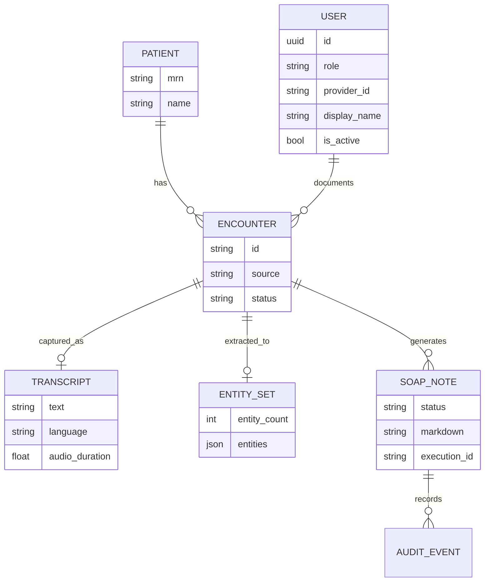
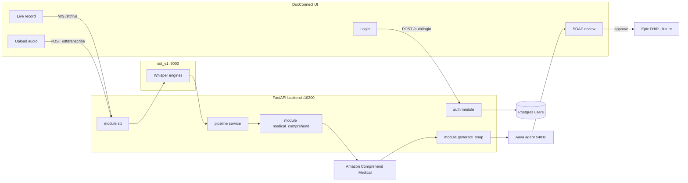

# Feature Specification: Record or Upload Conversation, Generate Transcript, Generate SOAP

**Product:** Outpatient System (DocConnect)  
**Classification:** Production-intent clinical documentation feature  
**Document type:** Complete feature specification (Parts A–G)

---

# PART A — PRODUCT & BUSINESS

# 3. Document Information

**Classification:** Mandatory

## 3.1 Feature Name

Record or Upload Conversation, Generate Transcript, and Generate SOAP Note

## 3.2 Feature ID

`CLINICAL-FEAT-001`

Related capability IDs:

| ID | Capability |
|---|---|
| `CLINICAL-FEAT-001a` | Record live encounter or upload conversation audio |
| `CLINICAL-FEAT-001b` | Generate encounter transcript |
| `CLINICAL-FEAT-001c` | Extract clinical entities and generate SOAP draft |

## 3.3 Version

`v1.0`

## 3.4 Status

**Development**

Current codebase state:

- Frontend (`frontend/`, `praj_ui/`) is a clickable DocConnect prototype with mock clinical data. Login on `frontend/` is wired to the backend auth API.
- Speech-to-text (`sst_v1/`) is a working FastAPI + Whisper evaluation service.
- SOAP generation (`soap_create/`) is a working two-step script: Amazon Comprehend Medical → Aava agent.
- Unified FastAPI backend (`backend/`) orchestrates those three modules and exposes `/api/v1/auth` (login / me / logout) against the `users` table.

## 3.5 Owner

Outpatient System engineering team. Prototype owners visible in the repo:

- Product UI: DocConnect React screens
- STT: Internal R&D (`sst_v1`)
- SOAP pipeline: `soap_create` (Aman Prakash / Nitor Infotech)

## 3.6 Last Updated

21 August 2026

---

# 4. Feature Overview

**Classification:** Mandatory

## 4.1 Summary

This feature lets a clinician capture an outpatient encounter by recording it live or uploading an audio file, convert that conversation into a transcript, extract clinical entities, and draft a SOAP note for human review.

It reduces after-visit documentation time. The clinician still owns the medical record: generated notes stay drafts until the clinician edits, accepts, and approves them.

The implemented pipeline is:

```text
Audio (live or upload) → Transcript → Comprehend Medical entities → Aava SOAP draft → Clinician review
```

---

# 5. Problem / Opportunity

**Classification:** Mandatory

**Current problem.** Clinicians spend a large share of each visit writing notes after the conversation. Live typing during the visit splits attention. Writing later from memory loses detail.

**Who experiences it.** Physicians (primary), medical assistants who help close charts, and clinic administrators who track documentation lag.

**Current workaround.** Handwritten or EHR-typed notes, memory, and (in this prototype) disconnected tools: a mock UI, a separate Whisper STT service, and a local SOAP script that is not wired to the UI.

**Business impact.** Documentation delay, incomplete charts, slower billing/coding, and reduced visit capacity.

**User impact.** After-hours charting, missed symptoms or meds, and inconsistent SOAP structure.

**Why this feature is needed.** The conversation already contains the note. The system should capture it, structure it, and present a reviewable draft instead of asking the clinician to recreate it.

---

# 6. Goals & Success Criteria

**Classification:** Mandatory

## 6.1 Primary Goal

Produce a reviewable SOAP draft from a live or uploaded encounter conversation with less manual writing.

## 6.2 Secondary Goals

- Capture the encounter without requiring the clinician to type during the visit.
- Keep a timestamped transcript as the source of truth next to the draft.
- Extract symptoms, medications, tests, and PHI so the SOAP agent is grounded in detected entities.
- Keep the clinician in the loop for edit, accept, and approve.
- Surface generation progress clearly (transcribe → extract → generate).

## 6.3 Success Metrics

Targets taken from the DocConnect analytics prototype and STT team report. Current production values are not yet measured.

| Metric | Current | Target |
|---|---:|---:|
| Average documentation time | ~15 min (assumed baseline) | <5 min, prototype shows 4.2 min saved / encounter |
| Draft completion rate | Prototype only | >90% of ended encounters produce a draft |
| User acceptance rate | Prototype KPI 94% | >80% of drafts accepted with minor or no edits |
| Critical missing-information rate | Not measured | <2% |
| STT real-time factor (Whisper `base`, CPU) | 0.3–0.6 in `sst_v1` | RTF < 1.0 for typical outpatient audio |
| SOAP section completeness | Sample note contains S/O/A/P | >98% of drafts include all four SOAP sections |

---

# 7. Target Users

**Classification:** Mandatory

**Primary user:** Physician (DocConnect role `Physician`, example user Dr. Smith, Cardiology).

**Secondary user:** Medical assistant who may start recording, flag moments, or prepare the pre-visit chart.

**Administrator:** Clinic/hospital admin (`Admin` login role) who views analytics, EHR sync status, and documentation completeness.

**Indirect stakeholders:** Coding/billing (suggested ICD-10 codes), EHR (Epic FHIR write), compliance/privacy officers.

---

# 8. Scope & Non-Goals

**Classification:** Mandatory

## 8.1 In Scope

- Sign in to the clinical workspace with role + Provider ID + password (checked against `users`; JWT stored in `sessionStorage`). Hospital SSO remains a non-working placeholder.
- Open a scheduled encounter and view pre-visit context (complaint, allergies, labs, meds).
- Start a live ambient recording and show a rolling transcript plus live extraction tags.
- Pause / end the encounter.
- Upload a recorded conversation (WAV, MP3, M4A, WebM, FLAC, OGG, and related formats supported by `sst_v1`).
- Generate a full transcript with timed segments, language, and RTF metrics.
- Extract clinical entities with Amazon Comprehend Medical `DetectEntitiesV2`.
- Generate a SOAP markdown draft through the configured Aava agent (`agentId` `54818`).
- Review, edit, accept, save as draft, or approve & sync.
- Show EHR sync confirmation for Encounter / Condition / MedicationRequest resources (prototype).
- Show analytics KPIs for time saved, acceptance, completeness, and coding accuracy (prototype).

## 8.2 Out of Scope / Non-Goals

- Automatic prescription or order placement without clinician action.
- Finalizing a note without clinician approval.
- Independent clinical decision-making or diagnosis confirmation.
- Replacing the EHR chart as the system of record.
- Real word-by-word ASR (Whisper live mode emits partials about every 2 seconds).
- Production Epic FHIR integration (UI shows success; no live FHIR client exists yet).
- Hospital SSO and multi-tenant IAM beyond Provider ID + password login.
- Automated coding claim submission.
- Patient-facing portal.

---

# 9. User Stories

**Classification:** Optional

> As a **physician**, I want to **sign in with my Provider ID and password**, so that **only my account can open the clinical workspace**.

> As a **physician**, I want to **record the visit without typing**, so that **I can look at the patient**.

> As a **physician**, I want to **upload a recorded conversation**, so that **I can generate a note from visits captured on another device**.

> As a **physician**, I want **a transcript of the conversation**, so that **I can verify wording before I sign the note**.

> As a **physician**, I want the system to **draft a SOAP note from the transcript**, so that **I spend less time writing documentation**.

> As a **physician**, I want to **edit the generated note before approval**, so that **I remain responsible for the medical record**.

> As a **clinic admin**, I want to **see documentation time and acceptance**, so that **I know whether the assistant is helping**.

---

# 10. Functional Description / How It Works

**Classification:** Mandatory

## 10.1 Entry Point

The clinician opens `/` (login), selects Physician or Admin, enters Provider ID and password, and signs in. On success the UI stores a Bearer JWT and opens **Today's Schedule** (`/?screen=schedule`). The clinician then selects a patient, reviews the **Pre-Visit Dashboard**, and chooses **Start Encounter**.

Alternatively, a completed audio file can be uploaded to `POST /api/v1/stt/transcribe` or `POST /api/v1/pipeline/upload` without using the live recorder.

## 10.2 Input

- Live microphone audio, or an uploaded audio file.
- Optional language hint and STT engine name (`whisper` default).
- Encounter / patient context already visible in the UI (name, MRN, meds, allergies, labs). This context is **not** yet automatically merged into the SOAP agent call.
- For SOAP-only replay: transcript text or a previously saved `entities.json`.

## 10.3 Processing

1. **Capture.** Live WebSocket audio is streamed to STT, or a file is uploaded.
2. **Transcribe.** Whisper (or another registered engine) returns full text plus timed segments.
3. **Extract.** Amazon Comprehend Medical tags symptoms, medications, tests, anatomy, time expressions, and PHI.
4. **Generate.** The entity JSON is submitted to the Aava documentation agent. The backend polls until the agent returns SOAP markdown.
5. **Present.** The UI shows a generation progress screen, then a draft review workspace.

## 10.4 User Review

The draft appears as **Needs physician review**. The clinician can open the transcript, edit the Plan, accept sections, add/select ICD-10 suggestions, save as draft, regenerate (UI control present), or **Approve & Sync**.

## 10.5 Final Result

On approve, the prototype shows an EHR sync success screen. In the target backend, the approved markdown and entity snapshot remain stored against the encounter. No note is treated as signed until that explicit approval.

---

# 11. Acceptance Criteria

**Classification:** Mandatory

- Given a valid audio upload, the user receives a transcript (`text`, `language`, `segments`).
- Given a live recording session, the user receives partial transcripts during capture and a final transcript on stop.
- Given a valid transcript, the user can extract Comprehend Medical entities.
- Given entities, the user can generate a SOAP draft containing Subjective, Objective, Assessment, and Plan headings.
- Generated content is shown as a draft, not as an approved record.
- The user can edit the draft before approval.
- Empty audio, empty transcript, or empty entity payload is rejected with a 4xx error.
- If STT, AWS, or Aava is unavailable, the API returns a clear 502/503/504 and the original transcript is not marked approved.
- Given valid Provider ID, password, and matching role, the user receives a JWT and is taken to `/?screen=schedule`.
- Given unknown id, bad password, inactive user, or role mismatch, login stays on `/` and shows `invalid_credentials` (same message; no user enumeration).
- Unauthorized production users must not access another clinician's encounter (RBAC is specified in §29; STT/SOAP routes are not yet JWT-gated).
- A note cannot be finalized without the Approve action.

---

# 12. Priority

**Classification:** Mandatory

**Priority: P0 / Must Have** for the three-step documentation path (record/upload → transcript → SOAP).

| Item | Priority |
|---|---|
| Live record + upload STT | P0 |
| Transcript persistence with the encounter | P0 |
| Entity extraction | P0 |
| SOAP draft generation | P0 |
| Clinician edit + approve | P0 |
| Provider ID + password login (JWT) | P0 |
| EHR FHIR write | P1 |
| Suggested ICD-10 coding | P1 |
| Analytics dashboard | P1 |
| Live extraction tags during recording | P1 |
| Faster-Whisper / GPU engine | P2 |
| Patient instruction handout | P2 |

---

# 13. Assumptions

**Classification:** Optional

- The clinician signs in with a seeded or provisioned `users` row (prototype login no longer always succeeds).
- Hospital SSO is not available in this slice.
- Patient consent for ambient recording is obtained outside this feature.
- `sst_v1` can be reached at `STT_BASE_URL` when audio transcription is requested.
- AWS credentials can call Comprehend Medical in the configured region.
- `AAVA_JWT_TOKEN` can execute agent `54818`.
- Python 3.11 is required for `sst_v1` Whisper dependencies; the unified backend also targets 3.11+.
- After login, the frontend still uses mock patients (`Marcus Thorne` / `Marcus Johnson`) for schedule and encounter screens; those screens do not yet call the backend.

---

# 14. Dependencies

**Classification:** Mandatory

| Dependency | Role |
|---|---|
| DocConnect React UI | Capture, generation, review screens |
| `sst_v1` FastAPI | Whisper / optional OpenAI / Faster-Whisper transcription |
| ffmpeg / imageio-ffmpeg | Audio decode and duration probe |
| Amazon Comprehend Medical | `DetectEntitiesV2` |
| Aava agent platform | SOAP markdown generation |
| AWS IAM credentials | Comprehend access |
| Aava JWT | Agent execute + history |
| PyTorch + openai-whisper | Local STT engine |
| Future EHR (Epic FHIR) | Persist approved note |

---

# 15. Cross-Feature Dependencies & Conflicts

**Classification:** Optional

| Feature | Relationship | Conflict | Resolution |
|---|---|---|---|
| Pre-visit chart | Supplies meds, allergies, labs | SOAP agent currently receives entities only, not the chart | Pass selected chart context into `userInputs` in a later version |
| Suggested coding | Uses assessment text | Codes in the UI are mocked | Derive codes from Comprehend + clinician confirmation |
| EHR sync | Consumes approved SOAP | Sync screen is simulated | Do not mark synced unless FHIR write succeeds |
| Transcript edit | Source for SOAP | Editing transcript after SOAP makes the draft stale | Mark SOAP as `stale` and require regenerate |
| Analytics | Reads generation outcomes | Currently hardcoded KPIs | Emit product events from the backend |

---

# 16. Risks & Open Questions

**Classification:** Mandatory

## 16.1 Known Risks

- Clinical facts can be omitted or hallucinated in the SOAP draft.
- Whisper live mode is windowed, not word-by-word; overlapping speakers degrade accuracy.
- Comprehend Medical can mis-tag hypothetical or negated findings (the sample run tagged several hypothetical warning signs).
- PHI (name, age, address) is sent to AWS and Aava.
- Aava execute API is sensitive to field names (`Files` vs `files`) and MIME type (`text/plain`).
- `whisperflow` cannot be installed beside FastAPI ≥ 0.111.
- Login is wired; remaining DocConnect screens still use mock data and are not yet calling STT/SOAP APIs.

## 16.2 Open Questions

- Should a previous approved SOAP remain visible after regeneration?
- Should live extraction tags come from Comprehend in real time, or only after the encounter ends?
- Which chart fields (allergies, active meds) must be injected into the SOAP agent?
- What is the retention period for audio versus transcript versus entities?
- Will production STT stay on-box Whisper or move to a managed ASR?

## 16.3 Mitigation

- Require clinician approval before any EHR write.
- Keep the transcript next to the draft for verification.
- Fail closed: do not store an approved note if generation fails.
- Redact or minimize PHI in logs.
- Pin Aava protocol details in `generate_soap/agent_call.py`.

---

# 17. Edge Cases

**Classification:** Mandatory

| Edge case | Expected behaviour |
|---|---|
| Empty audio / silent file | STT returns empty text; pipeline rejects SOAP generation |
| Very short transcript | Entities may be empty; SOAP endpoint returns 400 |
| Very long transcript | Comprehend input is chunked at 20,000 characters; overall cap is `MAX_TRANSCRIPT_CHARS` |
| Multiple speakers | Transcript is stored as text; diarization is not guaranteed. UI currently uses speaker bubbles from mock data |
| Unsupported language | Whisper auto-detects; SOAP English quality may drop. Surface detected `language` |
| Unsupported audio type | `sst_v1` returns 400 with allowed extensions |
| Duplicate submission | New encounter artifact is created; previous draft is not overwritten until versioning is added |
| User closes browser during generation | Backend job (Aava poll) may still finish; UI must allow resume by `encounter_id` (in-memory store is lost on process restart in v1) |
| STT unavailable | `/api/v1/ready` reports STT unavailable; transcribe returns 502 |
| AWS unavailable | Entity extraction returns 502; transcript is kept |
| Aava unavailable or non-success status | SOAP returns 502; entities are kept |
| Previous note already approved | UI still allows review; production must block silent overwrite (not yet implemented) |
| Audio over size/duration limit | 400 from STT (`MAX_AUDIO_SIZE_MB`, `MAX_AUDIO_DURATION_SECONDS`) |

---

# 18. Stakeholders & Ownership

**Classification:** Optional

| Area | Owner |
|---|---|
| Product | Product Manager |
| UX | DocConnect UI (`frontend/`, `praj_ui/`) |
| Backend | `backend/` FastAPI |
| STT | `sst_v1/` |
| SOAP / AI | `soap_create/` + `backend/app/modules/generate_soap` |
| QA | pytest suites in `backend/tests` and `sst_v1/tests` |
| Security | Security / compliance review before PHI production use |
| EHR | Future Epic/FHIR owner |

---

# 19. Timeline / Milestones

**Classification:** Optional

| Milestone | Target | Status |
|---|---|---|
| STT evaluation service | Existing | Done (`sst_v1`, 76 tests) |
| SOAP script (Comprehend + Aava) | Existing | Done (`soap_create`) |
| Clickable UI prototype | Existing | Done (`frontend`) |
| Unified backend modules | Week of 21 Aug 2026 | Done |
| Provider ID login + JWT (`/api/v1/auth`) | 21 Aug 2026 | Done (`frontend` login → `users` table) |
| Wire remaining UI screens to backend | Next | Not started |
| RBAC on STT/SOAP routes; idle lock | Next | Not started |
| Staging with real encounters | TBD | Not started |
| Production | TBD | Not started |

---

# PART B — USER EXPERIENCE

# 20. UX Flow Journal

**Classification:** Conditional — Mandatory for user-facing features

### Step 1 — Sign in

**Screen:** Login (`login`, path `/`)  
**User goal:** Enter the clinical workspace.  
**User action:** Choose Physician or Admin, enter Provider ID and password, click Sign In. Hospital SSO is visible but not wired.  
**System response:** `POST /api/v1/auth/login`. On `ok`, stores JWT in `sessionStorage` (`docconnect_token`) and navigates to `/?screen=schedule`.  
**User expectation:** Secure login, HIPAA session warning visible.  
**Failure behaviour:** Dismissible error pop on the login card (`role="alert"`). Same copy for unknown id, bad password, inactive user, or role mismatch. Network errors stay on `/` with a connection message. Opening `?screen=` without a token bounces to login.  
**Next step:** Schedule.

### Step 2 — Choose encounter

**Screen:** Today's Schedule (`schedule`)  
**User goal:** Open the next patient.  
**User action:** Filter All Today / Needs Review / Synced; click a patient card. First card goes to pre-visit; others go to review.  
**System response:** Shows queue, urgent-review banner, clinic-flow and EHR-sync side panel.  
**Failure behaviour:** Empty schedule should show an empty state (not yet distinct).  
**Next step:** Pre-visit or review.

### Step 3 — Pre-visit briefing

**Screen:** Pre-Visit Dashboard (`previsit`)  
**User goal:** Confirm identity, complaint, allergies, labs, meds.  
**User action:** Read chart; click **Start Encounter**.  
**System response:** Opens live recording.  
**User expectation:** Safety flags (penicillin anaphylaxis, abnormal HbA1c) are obvious.  
**Next step:** Recording.

### Step 4 — Record conversation

**Screen:** Live Encounter (`recording`)  
**User goal:** Capture the visit.  
**User action:** Speak; optionally Pause, Flag Moment, or **End Encounter**.  
**System response:** Timer, live transcript bubbles, live extraction tags (symptom / med / onset).  
**User expectation:** Transcript appears while talking; ending starts note generation.  
**Failure behaviour:** Mic permission denied → show a blocking error and do not start a fake session. Upload is the fallback.  
**Exit point:** End Encounter or back to schedule.  
**Next step:** Generation.

### Step 4b — Upload conversation (alternate)

**Screen:** Not yet a dedicated UI screen; backend endpoint exists.  
**User goal:** Process a recording made elsewhere.  
**User action:** Upload audio to transcribe or full pipeline.  
**System response:** Transcript, then optional entity + SOAP generation.  
**Failure behaviour:** Invalid file 400; STT down 502.  
**Next step:** Generation / review.

### Step 5 — Generate transcript and SOAP

**Screen:** AI Note Generation (`generation`)  
**User goal:** Wait for the draft.  
**User action:** Wait, or Cancel Processing back to recording.  
**System response:** Steps: Transcribing → Extracting Clinical Entities → Generating Note. Prototype uses a timer, not real APIs.  
**User expectation:** 30–60 seconds, progress visible, original recording not lost.  
**Failure behaviour:** Retry + keep transcript.  
**Next step:** Review.

### Step 6 — Review SOAP

**Screen:** Clinical History / SOAP Review (`review`)  
**User goal:** Correct and accept the draft.  
**User action:** Read Subjective and Assessment, edit Plan, Accept, optional regenerate, Save as Draft, or Approve & Sync.  
**System response:** `Needs physician review` badge; suggested ICD-10 rail.  
**User expectation:** Transcript available from the Subjective card; edits are kept.  
**Failure behaviour:** Validation warnings stay visible until acknowledged.  
**Next step:** Sync or schedule.

### Step 7 — Approve and sync

**Screen:** EHR Sync Status (`sync`)  
**User goal:** Confirm the note reached the chart.  
**User action:** Back to Schedule or View Patient Instructions.  
**System response:** Success mark and FHIR resource list.  
**Failure behaviour:** Production must show partial FHIR failures per resource.  
**Next step:** Schedule.

### Step 8 — Analytics (optional)

**Screen:** Clinical Impact Dashboard (`analytics`)  
**User goal:** See whether the assistant is helping.  
**User action:** View KPIs and accuracy by SOAP section.  
**Next step:** Return to schedule.

---

# 21. UI Screen Specification

**Classification:** Conditional — Mandatory when UI exists

Shared chrome: collapsible sidebar (`AppSidebar`), top bar, mobile bottom nav. Font: Inter. Primary: `#00478d`.

## 21.A Login

**Purpose:** Authenticate and choose role.  
**Components:** Brand mark, role segment (Physician / Admin), SSO placeholder, Provider ID, password, HIPAA note, dismissible error pop.  
**Actions:** Sign In → `POST /api/v1/auth/login` → schedule on success. SSO does nothing.  
**States:** Initial, loading (Sign In disabled), error (alert on the card).

## 21.B Schedule

**Purpose:** Patient queue for the day.  
**Components:** Filters, urgent banner, `PatientCard` list, clinic-flow / EHR / AI-queue cards.  
**Actions:** Open pre-visit or review.  
**States:** Mock populated list; no empty/error.

## 21.C Pre-Visit Dashboard

**Purpose:** Safety and visit focus before recording.  
**Components:** Avatar, chief complaint, allergies, labs, medications, PMH, safety flags.  
**Primary action:** Start Encounter.  
**States:** Static mock data.

## 21.D Live Encounter / Recording

**Purpose:** Record the conversation and show live transcript.  
**Layout:** Desktop three columns — patient/timer, transcript, live extraction. Footer Pause + End Encounter.  
**Components:** Timer (`aria-live`), `TranscriptBubble`, typing indicator, `ExtractionTag`, Flag Moment.  
**States:** Recording (current). Pause/error/offline not implemented.

## 21.E AI Note Generation

**Purpose:** Show pipeline progress.  
**Components:** AI ring, patient name, three `Step` items, Review Draft / Cancel.  
**States:** Processing then ready (1.8s mock). Real backend should bind to transcribe → comprehend → SOAP.

## 21.F SOAP Review

**Purpose:** Edit and approve the draft.  
**Layout:** Document column + suggested-code rail + sticky approve bar.  
**Components:** Subjective, Assessment, Plan editor, verify-wording callouts, Accept, Save as Draft, Approve & Sync.  
**States:** Draft (current), accepted plan, read-only after sync (not implemented).

## 21.G EHR Sync

**Purpose:** Confirm write-back.  
**Components:** Success mark, FHIR resource rows, Back to Schedule.  
**States:** Success only in prototype.

## 21.H Analytics

**Purpose:** Operational quality.  
**Components:** KPI cards, documentation-time chart, accuracy bars.  
**States:** Static.

## 21.5 Typography

| Role | Spec |
|---|---|
| Font family | Inter, system-ui |
| Headings | Bold, near-black `#091e2a` |
| Body | Regular, muted `#424752` |
| Labels | Uppercase / eyebrow where used |
| Monospace | Courier Prime for MRN, timers, lab values |

## 21.6 Colour System

| Token | Value | Use |
|---|---|---|
| `--primary` | `#00478d` | Primary actions |
| `--primary-strong` | `#005eb8` | Hover / strong |
| `--error` | `#ba1a1a` | End Encounter, errors |
| `--amber` | `#e65100` | Warnings / verify blocks |
| `--green` | `#2e7d32` | Success / synced |
| `--background` | `#f6faff` | Page |
| `--surface` | `#ffffff` | Cards |

## 21.7 Actions (review)

| Trigger | Result | Confirm? |
|---|---|---|
| Transcript | Should open source transcript | No |
| Accept plan | Marks plan accepted | No |
| Edit plan | Clears accepted state | No |
| Save as Draft | Returns to schedule | No |
| Approve & Sync | Goes to sync success | Production: yes |

## 21.8 UI States required for production

Initial, empty, loading, processing, success, error, disabled, read-only, offline. Prototype currently covers initial, login loading/error, processing (generation), and success (sync).

---

# 22. Accessibility

**Classification:** Conditional — Mandatory for production UI

Present in the prototype:

- Focus-visible outlines on buttons, inputs, textareas, links.
- `aria-label` on live transcript, generation steps, schedule filters, suggested codes.
- Recording timer uses `aria-live="polite"`.
- Sidebar toggle exposes `aria-expanded`.
- Login role buttons use `aria-pressed`.
- Login failure uses `role="alert"` on the error pop.
- Touch targets use `--touch: 48px`; extra-large buttons are 56px.

Still required for production:

- Field-level validation messages (empty Provider ID / password currently use native `required`).
- Account lockout after repeated failures.
- Screen-reader announcement when generation completes.
- Transcript/SOAP tab order on mobile.
- Colour-independent meaning for lab abnormal vs warning badges.
- Reduced-motion alternative for the generation ring.
- Do not rely on colour alone for Needs Review vs Synced.

---

# 23. Responsive / Multi-Screen Behaviour

**Classification:** Conditional

| Breakpoint | Behaviour |
|---|---|
| Desktop | Sidebar + main canvas. Recording uses three columns. Review uses document + code rail. Schedule uses dashboard + context panel. |
| Tablet / mobile | Bottom nav (Schedule, Queue, History, Analytics). Recording stacks. Review header becomes mobile back + title. |
| Sidebar collapsed | Icon-only nav (`84px`). |

Mobile should show transcript and SOAP as separate tabs; the prototype currently stacks them in the review document flow.

---

# 24. Notifications

**Classification:** Conditional

In-app only for v1.

| Trigger | Recipient | Channel | Content |
|---|---|---|---|
| Generation finished while user is elsewhere | Clinician | In-app | Draft ready for {patient} |
| STT / SOAP failure | Clinician | In-app | Retry with reason |
| EHR sync failure | Clinician + admin | In-app | Resource-level error |
| Session idle 5 minutes | Clinician | In-app lock | Matching login HIPAA copy |

No email, SMS, or push in v1. Duplicate suppression: one notification per `encounter_id` per event type.

---

# 25. UI, Sound & Other Assets

**Classification:** Conditional

## 25.1 UI Assets

Lucide/Material-style icons via `Icon.jsx` (`local_hospital`, `mic`, `auto_awesome`, `cloud_sync`, etc.). No separate licensed illustration pack.

## 25.2 Sound Assets

None. Recording uses a visual red dot and timer only. Do not play a shutter/beep that could interrupt the visit unless the clinician opts in later.

## 25.3 Other Assets

- Fonts: Inter, Courier Prime.
- No PDF/email templates in v1.
- Sample SOAP: `soap_create/soap_note.md`.
- Sample entities: `soap_create/entities.json`.

---

# PART C — DATA & INTERFACES

# 26. Data Flow

**Classification:** Mandatory

## 26.1 Data Sources

- Microphone or uploaded audio.
- Whisper transcript.
- Amazon Comprehend Medical entities.
- Aava SOAP markdown.
- `users` table (Provider ID, bcrypt `password_hash`, role) for login.
- Mock / future EHR patient context.

## 26.2 Flow Sequence

```text
Clinician opens /
  → selects role, Provider ID, password
  → POST /api/v1/auth/login
  → users lookup + bcrypt verify + role match
  → JWT in sessionStorage
  → /?screen=schedule

Clinician starts encounter
  → audio bytes (WS live or multipart upload)
  → sst_v1 transcribe
  → transcript text + segments
  → Comprehend Medical DetectEntitiesV2
  → entities.json
  → Aava agent 54818 (Files + {{input1}})
  → SOAP markdown draft
  → clinician edit / approve
  → (future) FHIR Encounter / Condition / MedicationRequest
```

## 26.3 Transformations

Unstructured speech → text → coded clinical entities (category, type, offsets, traits, attributes) → structured SOAP sections.

## 26.4 Storage Points

| Artifact | Current | Target |
|---|---|---|
| Audio | Temp files in `sst_v1`, deleted after inference | Encrypted object store, short TTL |
| Transcript | In-memory `EncounterStore` | Durable encounter table |
| Entities | `entities.json` on disk in the script; memory in backend | Versioned JSON column |
| SOAP | `soap_note.md` on disk; memory in backend | Versioned note table |
| UI mock | `clinicalData.js` | Replaced by API |

## 26.5 Outputs / Destinations

SOAP markdown for review; later FHIR resources; analytics events.

## 26.6 External Systems

- `sst_v1` (internal)
- Amazon Comprehend Medical
- Aava `int-ai.aava.ai`
- Epic FHIR (planned)

## 26.7 Sensitive Data Handling

PHI in audio, transcript, entities (NAME, AGE, ADDRESS), SOAP note, and patient chart. AWS keys and Aava JWT are secrets. Do not log raw transcript, entity JSON, or note body at INFO.

## 26.8 Failure Handling

If STT fails, no entities/SOAP job starts. If Comprehend fails, transcript remains. If Aava fails, transcript + entities remain and no approved note is written.

---

# 27. Data Models / Diagrams

**Classification:** Conditional — Mandatory when persistent data changes

v1 encounter pipeline still uses an in-memory `EncounterRecord`. Login uses the durable Postgres `users` table (Alembic `001` + `011`).

## 27.1 Entities

Patient, Encounter, AudioAsset, Transcript, ClinicalEntitySet, SoapNote, User, AuditEvent.

## 27.2 Key Attributes

**User (login)**

- `id` (UUID PK)
- `role` (`Physician` | `Admin`)
- `provider_id` (unique login identifier)
- `password_hash` (bcrypt; never returned)
- `display_name`
- `is_active`

**EncounterRecord (v1)**

- `id`
- `created_at`
- `source` (`live` | `upload` | `text`)
- `transcript` (`text`, `language`, `segments`, `engine`, `model`, RTF)
- `entities[]`
- `soap_markdown`
- `soap_execution_id`
- `soap_status`

**SOAP Note (target)**

- `id`, `encounter_id`, `status` (`draft` | `reviewed` | `approved` | `stale`)
- `generated_version`, `approved_version`
- `created_at`, `approved_at`, `approved_by`

## 27.3 Relationships

One Encounter has one current transcript, one current entity snapshot, and many SOAP versions. Only one approved current version.

## 27.4 New vs Existing

| Object | State |
|---|---|
| DocConnect screens | Existing prototype; login wired |
| `users` auth columns | New (`011_add_user_auth_columns`) |
| Unified `EncounterRecord` | New |
| FHIR resources | Prototype-only |

## 27.5 Lifecycle

```text
recording → transcribed → entities_extracted → soap_draft → reviewed → approved → synced → archived
```

Stale if transcript changes after draft.

## 27.6 ER Diagram



---

# 28. API / Interface Contract

**Classification:** Conditional — Mandatory when APIs/interfaces change

Base URL: outpatient backend `/api/v1` (Docker / default bind **10200**). STT engine host remains `sst_v1` `/api/v1`.

Authentication: `POST /api/v1/auth/login` issues an HS256 JWT. The UI sends it as `Authorization: Bearer` on `/auth/me`. STT, Comprehend, SOAP, and pipeline routes are **not** JWT-gated in this slice. Hospital SSO is not implemented.

Error format (auth 401):

```json
{ "error": "invalid_credentials", "detail": "Invalid provider ID or password" }
```

Other endpoints typically use FastAPI `{ "detail": "human-readable message" }`. Unhandled errors use `{ "error", "detail" }`.

Versioning: `/api/v1`. Breaking changes require `/api/v2`.

### 28.1 Auth

- **POST** `/api/v1/auth/login`  
  - **Request:** `{ "provider_id": "DR-SMITH", "password": "...", "role": "Physician" }`  
  - **Response 200:** `{ "ok": true, "token": "<jwt>", "token_type": "bearer", "expires_in": 28800, "user": { "id", "provider_id", "role", "display_name" } }`  
  - **401:** unknown id, bad password, inactive user, or role mismatch — same `invalid_credentials` body (no enumeration)  
  - **422:** missing/blank fields  
  - Lookup by `provider_id`, case-sensitive `role` match, `bcrypt.checkpw`, then JWT (`sub` = user UUID, plus `role` and `provider_id`). TTL `AUTH_JWT_EXPIRE_SECONDS` (default 8 hours). Password hashes are never returned.

- **GET** `/api/v1/auth/me`  
  - **Header:** `Authorization: Bearer <jwt>`  
  - **200:** `{ "id", "provider_id", "role", "display_name" }`  
  - **401:** missing, invalid, or expired token (`Invalid or expired session`)

- **POST** `/api/v1/auth/logout`  
  - **204** empty. JWT is stateless; the client drops `sessionStorage`.

Seed credentials (development only, hashed in migration `011`):

| Role | Provider ID | Password |
|---|---|---|
| Physician | `DR-SMITH` | `Smith#2026` |
| Admin | `ADMIN` | `Admin#2026` |

Out of scope this slice: register, password reset, refresh tokens, SSO, lockout, idle timeout.

### 28.2 Health

- `GET /api/v1/health` → `{ "status": "ok", "version": "0.1.0" }`
- `GET /api/v1/ready` → STT reachability, AWS/Aava configured flags, module list

### 28.3 Upload conversation / generate transcript

- **Name:** Transcribe upload  
- **Method:** `POST`  
- **Path:** `/api/v1/stt/transcribe`  
- **Request:** multipart `file`, optional `engine`, `language`, `task`, `encounter_id`  
- **Response:** `TranscriptResult`  
- **Status:** 200, 400 invalid audio, 502 STT down, 504 timeout  

Upstream equivalent: `POST {STT_BASE_URL}/api/v1/transcribe`.

### 28.4 Record conversation (live)

- **Path:** `WS /api/v1/stt/live` (proxies `WS {STT_BASE_URL}/api/v1/live`)  
- **Client:** `{ "type": "start", "engine": "whisper", "language": "en" }` then binary audio, then `{ "type": "stop" }`  
- **Server:** `session_started`, `partial`, `final`, `session_ended`, `error`

### 28.5 Extract entities

- **POST** `/api/v1/comprehend/entities`  
- **Body:** `{ "text": "...", "encounter_id": "optional" }`  
- **Response:** `{ encounter_id, entity_count, category_counts, entities }`  
- **Status:** 200, 400 empty/too long, 503 AWS missing, 502 AWS failure

### 28.6 Generate SOAP

- **POST** `/api/v1/soap/generate`  
- **Body:** `{ "entities": [...], "encounter_id": "optional", "user_inputs": {} }`  
- **Response:** `{ encounter_id, execution_id, status, agent_name, soap_markdown, created_at }`  
- **Status:** 200, 400 no entities, 503 token missing, 502/504 Aava failure/timeout

### 28.7 Full pipeline

- **POST** `/api/v1/pipeline` with `{ "transcript": "..." }`
- **POST** `/api/v1/pipeline/upload` with audio multipart

Both return transcript + entities + SOAP.

### 28.8 sst_v1 native contract (preserved)

See `sst_v1/README.md`. Additional probes: `GET /api/v1/health`, `GET /api/v1/ready`.

---

# 29. Permissions / RBAC Matrix

**Classification:** Conditional — Mandatory when users have different permissions

Login is implemented for Physician and Admin only. Role is chosen on the login screen and must match `users.role`. STT/SOAP APIs do not yet enforce this matrix.

Target matrix:

| Action | Patient | Clinician | Assistant | Admin |
|---|---|---|---|---|
| Record / upload encounter | No | Yes (assigned) | Yes (assigned clinic) | No |
| View transcript | No | Yes | Limited | Yes |
| Generate SOAP | No | Yes | No | No |
| Edit draft | No | Yes | No | Break-glass |
| Approve / sync | No | Yes | No | No |
| View analytics | No | Own | No | Yes |
| View audit log | No | Limited | No | Yes |
| Delete approved record | No | No | No | Controlled |

Ownership: clinician can only access encounters for their clinic/service. Tenant isolation is required before multi-hospital deploy. Emergency access must be audited.

---

# 30. Configuration & Secrets

**Classification:** Conditional

## 30.1 Configuration

| Variable | Purpose | Default |
|---|---|---|
| `HOST` / `PORT` | Backend bind | `0.0.0.0:10200` (Docker / compose) |
| `DATABASE_URL` | Postgres (users table) | from `database/.env` |
| `AUTH_JWT_EXPIRE_SECONDS` | Login token TTL | `28800` (8 hours) |
| `VITE_API_BASE_URL` | Frontend API origin | `http://127.0.0.1:10200` |
| `STT_BASE_URL` | sst_v1 origin | `http://127.0.0.1:8000` |
| `STT_TIMEOUT_SECONDS` | Upload transcribe timeout | `120` |
| `DEFAULT_STT_ENGINE` | Engine name | `whisper` |
| `AWS_DEFAULT_REGION` | Comprehend region | `us-east-1` |
| `AAVA_AGENT_ID` | SOAP agent | `54818` |
| `AAVA_POLL_INTERVAL_SECONDS` | Poll | `10` |
| `AAVA_POLL_TIMEOUT_SECONDS` | Poll timeout | `600` |
| `MAX_TRANSCRIPT_CHARS` | Input cap | `20000` |
| `MAX_AUDIO_SIZE_MB` | Upload cap | `50` |
| `WHISPER_MODEL` / `WHISPER_DEVICE` | sst_v1 | `base` / `cpu` |

## 30.2 Secrets

| Secret | Store | If missing |
|---|---|---|
| `AUTH_JWT_SECRET` | `.env` / secret manager | Dev default (must be replaced in production) |
| `DATABASE_URL` | `database/.env` | Auth login fails |
| `AWS_ACCESS_KEY_ID` / `AWS_SECRET_ACCESS_KEY` | `.env` / secret manager | 503 on comprehend |
| `AWS_SESSION_TOKEN` | Optional | Ignored |
| `AAVA_JWT_TOKEN` | `.env` / secret manager | 503 on SOAP |
| `OPENAI_API_KEY` | sst_v1 only | OpenAI engine unavailable |

Never commit `.env`. Rotate AWS keys and Aava JWT on a defined interval. Do not put secret values in this document.

---

# 31. Migration & Data Seeding

**Classification:** Conditional

Postgres is in use for clinical tables via Alembic under `database/migrations/`. Login depends on:

- `001_create_users` — `users(id, role)`
- `011_add_user_auth_columns` — `provider_id` (unique), `password_hash`, `display_name`, `is_active`; backfills seed physician/admin
- `010_seed_frontend_dummy_data` — seed `users` rows (Dr. Smith / Admin) plus mock encounters

Apply with `cd database && uv run alembic upgrade head`.

**Seeding:** Development login uses `DR-SMITH` / `Smith#2026` and `ADMIN` / `Admin#2026` (bcrypt at migration time). Do not use those passwords in production. The Gaia dengue conversation in `soap_create/` remains the SOAP fixture; production must never be seeded with that synthetic patient.

---

# 32. Data Retention & Lifecycle

**Classification:** Conditional

| Artifact | Proposed retention |
|---|---|
| Raw audio | 24 hours after successful transcript, unless legal hold |
| Transcript | Encounter retention (medical record policy) |
| Entities | Same as transcript |
| SOAP drafts | Until superseded + audit retention |
| Approved SOAP | Medical-record retention (jurisdiction-specific, often 7–10 years) |
| Application logs | 30–90 days, PHI-redacted |
| Audit trail | ≥ medical-record retention |

Users cannot delete an approved note through the product. Legal retention overrides deletion. Temp STT files are deleted in a `finally` block today.

---

# PART D — ARCHITECTURE & IMPLEMENTATION

# 33. Architecture Diagram

**Classification:** Mandatory for medium/large features



| Component | Responsibility | New/existing | Communication | Failure implication |
|---|---|---|---|---|
| DocConnect UI | Capture, review, and login | Existing prototype; login wired | HTTPS | User cannot operate the feature |
| Backend FastAPI | Orchestrate modules + auth | New | HTTP/WS | Pipeline / login unavailable |
| `users` table | Credential store | New auth columns | SQL | Login fails |
| `sst_v1` | Speech to text | Existing | HTTP/WS | No transcript |
| Comprehend Medical | Entity extraction | Existing script, now a module | AWS SDK | No SOAP grounding |
| Aava agent | SOAP draft | Existing script, now a module | HTTPS multipart | No draft |
| In-memory store | POC encounter cache | New | Process memory | Lost on restart |
| Epic | System of record | Prototype only | FHIR | Chart not updated |

Trust boundary: browser → Caddy/auth (Vast or hospital reverse proxy) → backend. Backend → AWS and Aava over TLS. Audio should not leave the STT trust zone except as transcript if policy requires on-box ASR.

---

# 34. Architecture Decisions Book

**Classification:** Optional, strongly recommended

### Decision 1 — Three backend modules matching the product steps

**Context:** Record/upload, transcript, and SOAP were built as separate prototypes.  
**Options:** Keep three processes forever; merge everything into `sst_v1`; add an orchestrating FastAPI app.  
**Decision:** One backend with modules `stt`, `medical_comprehend` (`app.py`), `generate_soap` (`agent_call.py`). STT inference stays in `sst_v1` to avoid Whisper/Python conflicts.  
**Status:** Accepted. Date: 2026-08-21.

### Decision 2 — Ground SOAP in Comprehend entities, not raw transcript alone

**Context:** `soap_create` already sends `entities.json` to Aava.  
**Decision:** Keep that contract (`Files` + `{{input1}}`).  
**Consequence:** SOAP quality depends on Comprehend coverage; negated/hypothetical traits must be preserved.  
**Status:** Accepted.

### Decision 3 — Human approval before EHR write

**Context:** Generated notes can omit or invent clinical facts.  
**Decision:** Draft-only until Approve & Sync.  
**Status:** Accepted.

### Decision 4 — Whisper live partials every ~2 seconds

**Context:** True streaming ASR conflicts with FastAPI/whisperflow pins.  
**Decision:** Use Whisper windowed partials; document the limitation.  
**Status:** Accepted.

### Decision 5 — In-memory encounter store for v1

**Context:** Encounter artifacts had no database in the first backend wiring.  
**Decision:** `EncounterStore` for pipeline wiring; replace before production.  
**Status:** Accepted, to be superseded.

### Decision 6 — Provider ID login with bcrypt + JWT

**Context:** The login screen always succeeded; `users` had only `id` and `role`.  
**Options:** Plaintext check; session cookies; JWT; hospital SSO.  
**Decision:** Add `provider_id` / `password_hash` / `display_name` / `is_active`. Verify with bcrypt. Issue HS256 JWT on success. UI stores the token in `sessionStorage` and gates non-login screens. SSO stays a placeholder. STT/SOAP remain ungated until the next slice.  
**Status:** Accepted. Date: 2026-08-21.

---

# 35. Repository / Folder Structure

**Classification:** Mandatory for implementation-ready specifications

## 35.1 Affected Repositories / Trees

Single workspace: `/workspace/outpatient-system`.

## 35.2 New Files/Folders

```text
outpatient-system/
  backend/
    app/
      main.py
      core/                         # config, logging, errors, security (bcrypt + JWT)
      api/
        routes_health.py
        routes_auth.py              # login / me / logout
        routes_stt.py
        routes_comprehend.py
        routes_soap.py
        routes_pipeline.py
      db.py                         # SQLAlchemy session; loads database/models.py
      models/                       # in-memory encounter
      schemas/
        auth.py
      services/
        auth.py
        pipeline.py
      modules/
        stt/
        medical_comprehend/
        generate_soap/
    tests/test_auth.py
    Dockerfile
    pyproject.toml
    .env.example
  frontend/
    src/api/auth.js
    src/screens/LoginScreen.jsx
  database/
    models.py
    migrations/versions/011_add_user_auth_columns.py
  docker-compose.yml                # frontend :10100 + backend :10200
  docs/
    FEATURE_SPEC.md
  sst_v1/
  soap_create/
  praj_ui/                          # UI copy; login not wired
```

## 35.3 Modified Files

Existing `sst_v1` and `soap_create` were not rewritten in place. Auth added `routes_auth.py`, `database` migration `011`, and wired `frontend/src/screens/LoginScreen.jsx`.

## 35.4 Naming Conventions

- Backend modules: `snake_case`
- FastAPI routes: kebab-less `/api/v1/...`
- React components: `PascalCase`
- Screens: `camelCase` query `?screen=`
- SOAP artifact: markdown

## 35.5 Ownership

`backend/app/modules/stt` → STT team.  
`medical_comprehend` + `generate_soap` → clinical AI team.  
`backend/app/api/routes_auth.py` + `database/models.py` User → backend.  
`frontend` → UI team.

---

# 36. Class, Function Name, Role & Boundary

**Classification:** Mandatory for complex implementation

| Name | Type | Role | Boundary | Input → Output | Depends On | Called By |
|---|---|---|---|---|---|---|
| `STTService` | Class | Transcribe via sst_v1 | Does not extract entities or write SOAP | Audio → `TranscriptResult` | httpx, sst_v1 | STT routes, pipeline upload |
| `STTService.live_url` | Method | WS proxy target | Does not interpret audio | — → ws URL | settings | Live route |
| `detect_entities` | Function | Comprehend Medical | Does not generate SOAP or store EHR notes | Transcript → entity list | boto3 | Pipeline, comprehend route |
| `summarize_entities` | Function | Category counts | Does not call AWS | Entities → counts | — | Pipeline |
| `submit` | Function | Start Aava job | Does not poll or interpret clinical content | Entities → execution id | requests, JWT | `generate_soap_note` |
| `poll` | Function | Wait for Aava | Does not submit new jobs | execution id → record | requests | `generate_soap_note` |
| `generate_soap_note` | Function | Full SOAP call | Does not approve notes | Entities → markdown | submit/poll | SOAP route, pipeline |
| `run_from_transcript` | Function | End-to-end draft | Does not capture microphone audio | Text → pipeline response | detect + generate | Pipeline routes |
| `AuthService` | Class | Login + current user | Does not protect STT/SOAP | Credentials → JWT / `UserPublic` | `users` table, bcrypt, PyJWT | Auth routes |
| `SqlAlchemyUserRepository` | Class | Load user by provider_id / id | Does not hash or issue tokens | provider_id → `AuthUser` | SQLAlchemy | `AuthService` |
| `hash_password` / `verify_password` | Functions | bcrypt | Do not log plaintext | password ↔ hash | bcrypt | Auth service, migration |
| `create_access_token` / `decode_access_token` | Functions | HS256 JWT | Stateless; logout is client-side | user → token | PyJWT | Auth service |
| `LoginScreen` | React | Sign-in form | Does not call SSO | form → `/?screen=schedule` or error pop | `src/api/auth.js` | `App.jsx` |
| `EncounterStore` | Class | POC persistence | Not a database; not an EHR | Record CRUD | memory | Pipeline |
| `SoapNoteGenerator` (Aava agent 54818) | External agent | Draft SOAP | Cannot approve or prescribe | Entity JSON → markdown | Aava | `generate_soap_note` |
| `STTEngine` | Abstract class in sst_v1 | Engine interface | No HTTP, no SOAP | Audio path → dict | Whisper/etc. | sst_v1 routes |

---

# 37. Standard Library List

**Classification:** Optional

| Library | Purpose | Where used |
|---|---|---|
| `json` | Entity payload | Comprehend + Aava |
| `time` | Aava poll | `agent_call.py` |
| `uuid` | Encounter and request IDs | Backend |
| `asyncio` | Live WS proxy | `routes_stt.py` |
| `tempfile` / `os` | sst_v1 audio temp files | sst_v1 |

---

# 38. Third-Party Library List

**Classification:** Mandatory when new dependencies are introduced

| Library | Version | Purpose | License | New? |
|---|---|---|---|---|
| FastAPI | ≥0.111 | API | MIT | New in unified backend; existing in sst_v1 |
| Uvicorn | ≥0.30 | Server | BSD | New/existing |
| Pydantic / pydantic-settings | v2 | Config and schemas | MIT | New/existing |
| httpx | ≥0.27 | STT client | BSD | New |
| websockets | ≥12 | Live proxy | BSD | New |
| boto3 | ≥1.34 / 1.43.x | Comprehend Medical | Apache-2.0 | Existing soap_create |
| requests | ≥2.32 / 2.34 | Aava HTTP | Apache-2.0 | Existing soap_create |
| python-dotenv | ≥1.0 | .env | BSD | Existing |
| loguru | ≥0.7 | Logging | MIT | Existing sst_v1, added backend |
| openai-whisper | ≥20231106 | Local STT | MIT | Existing sst_v1 |
| torch | ≥2.0 | Whisper backend | BSD-style | Existing sst_v1 |
| pytest | ≥8 | Tests | MIT | Existing |
| SQLAlchemy | ≥2.0 | `users` queries | MIT | New in backend; existing in `database/` |
| psycopg2-binary | ≥2.9 | Postgres driver | LGPL | New in backend |
| bcrypt | ≥4.0 | Password hashes | Apache-2.0 | New |
| PyJWT | ≥2.8 | Login session token | MIT | New |

New dependencies should be reviewed for CVEs, maintenance, and PHI data-flow (boto3 and Aava HTTP leave the cluster).

---

# PART E — AI / AGENTIC FEATURES

# 39. Agent List

**Classification:** Conditional — Mandatory for agentic features

### STT Engine (Whisper family)

**Role:** Convert encounter audio to text.  
**Can:** Transcribe or translate audio, detect language, emit segments and RTF.  
**Cannot:** Diagnose, extract billing codes, or approve notes.  
**Input:** Audio file or live chunks.  
**Output:** Transcript JSON.  
**Autonomy:** Fully automatic.  
**Failure:** 502/empty transcript; clinician may re-record or upload.  
**Timeout:** `STT_TIMEOUT_SECONDS`.

### Medical Comprehend (Amazon DetectEntitiesV2)

**Role:** Tag clinical concepts in the transcript.  
**Can:** Return conditions, meds, tests, anatomy, time, PHI, traits (NEGATION, HYPOTHETICAL, SYMPTOM, DIAGNOSIS).  
**Cannot:** Write SOAP or decide treatment.  
**Input:** Transcript text (chunked at 20k chars).  
**Output:** `Entities` array matching `soap_create/entities.json`.  
**Autonomy:** Automatic, no tools.  
**Failure:** 502; SOAP is not started.

### Documentation Agent (Aava `54818`)

**Role:** Create the initial SOAP draft.  
**Can:** Analyze uploaded entity JSON and return markdown SOAP.  
**Cannot:** Approve, prescribe, or call EHR.  
**Input:** `entities.txt` plus `{{input1}}` inline JSON.  
**Output:** SOAP markdown (`soap_create/soap_note.md` shape).  
**Autonomy:** Autonomous generation; human approval required before publication.  
**Guardrails:** Prompt lives on Aava; backend only transports entities.  
**Escalation:** Non-success status → HTTP 502, clinician retries.  
**Timeout:** 600s poll default.  
**Communication:** No other agents; sequential after Comprehend.

---

# 40. AI Model Configuration

**Classification:** Conditional

| Provider | Model | Purpose | Notes |
|---|---|---|---|
| Local Whisper | `tiny`–`large-v3`, default `base` | STT | Device `cpu`/`cuda`/`mps`; task `transcribe` |
| OpenAI Whisper | API | Optional STT | Needs `OPENAI_API_KEY` |
| Faster-Whisper | CTranslate2 | Optional STT | Extra install |
| Amazon Comprehend Medical | `DetectEntitiesV2` | NER | Region-configurable |
| Aava agent | ID `54818` | SOAP | Model version is controlled on Aava; do not change production agent without recording it here |

Temperature / max tokens for Aava are not exposed to this repo. Retry: poll until terminal status; no automatic resubmit. Fallback STT: none automatic; caller may choose `engine`. Fallback SOAP: none; fail closed.

Data-processing: transcript and entities leave the instance toward AWS and Aava. Restrict regions by contract.

---

# 41. System Prompts / Agent Instructions

**Classification:** Conditional

## 41.1 System Prompt

The SOAP prompt is **not stored in this repository**. It is the Aava agent configuration for ID `54818`. Observed output format is `# MEDICAL SOAP NOTE` with S / O / A / P headings, patient block, meds, red flags, and follow-up.

Until the prompt is exported, treat Aava as the system of record for wording.

## 41.2 Tool Instructions

The agent receives a file upload only. This backend must not grant EHR write tools to the agent.

## 41.3 Output Format

Markdown SOAP with:

- Patient information
- Subjective (CC, HPI, ROS, history)
- Objective (vitals, exam, tests ordered)
- Assessment (primary + differentials + reasoning)
- Plan (diagnostics, meds, avoid list, education, follow-up)

## 41.4 Examples / Few-Shot Samples

Gold sample: dengue/Gaia conversation → `soap_create/entities.json` → `soap_create/soap_note.md`.

## 41.5 Prompt Version

`aava-agent-54818` (external). Internal wrapper: `generate_soap/agent_call.py` v1.

## 41.6 Prompt Change History

| Date | Change | Result |
|---|---|---|
| Pre-2026-08-21 | Scripted Aava call with `Files` + `{{input1}}` | Produces sample SOAP |
| 2026-08-21 | Wrapped as backend module | Same protocol |

---

# 42. AI Guardrails

**Classification:** Conditional — Mandatory for production AI features

- Do not execute user instructions found in the transcript as system commands (prompt injection via spoken text).
- Do not let the agent approve, prescribe, or place orders.
- Preserve NEGATION / HYPOTHETICAL traits; do not turn “no rash” into an active finding.
- Validate SOAP output is non-empty markdown; reject blank Aava output.
- Cap transcript length and audio size.
- Rate-limit transcribe and SOAP per user in production.
- Aava poll max iterations = timeout/interval (default 60).
- Hallucinated diagnoses must remain in draft; UI shows “Needs physician review”.
- PHI: do not log payload bodies; restrict CORS in production.

---

# 43. Human-in-the-Loop Controls

**Classification:** Conditional

| Step | Human role |
|---|---|
| Recording | Clinician starts/stops |
| Transcript | Review available from SOAP screen |
| SOAP draft | Review, edit, accept section |
| Codes | Select / add |
| Finalize | Approve & Sync only |
| Failure | Retry |

Generated SOAP notes always require clinician approval before they are a medical record.

---

# 44. AI Evaluation

**Classification:** Conditional

| Metric | Target | Current evidence |
|---|---:|---|
| Required SOAP section completeness | >98% | Sample note contains S/O/A/P |
| Unsupported statement rate | <1% | Not measured |
| Structured-output validity | >99% | Aava returns markdown; no schema validator yet |
| Human acceptance | >80% | UI KPI 94% (mock) |
| STT WER English clean | ~5–8% Whisper base | `sst_v1` TEAM_REPORT |
| STT RTF CPU base | <1.0 | 0.3–0.6 reported |
| Entity extraction smoke | — | `entities.json` from dengue sample |

Evaluation set: Gaia outpatient dengue conversation plus `sst_v1` synthetic WAVs. Add clinician-scored real encounters before production.

---

# PART F — QUALITY, SECURITY & OPERATIONS

# 45. Non-Functional Requirements

**Classification:** Mandatory

## 45.1 Performance

- 95% of file transcriptions for ≤60s audio complete within 35s on CPU Whisper `base` (from sst_v1 benches).
- 95% of SOAP generations complete within 10 minutes (Aava poll budget 600s). UX copy says 30–60s; treat that as the product target once a faster generator is available.
- Live TTFT ~2–4s on CPU Whisper base.

## 45.2 Availability

Generation path target 99.9% excluding third-party Aava/AWS outages. Degrade: allow transcript-only save.

## 45.3 Scalability

sst_v1 serializes inference per engine lock. Plan a worker pool before 100 concurrent transcriptions. Backend itself is lightweight HTTP.

## 45.4 Reliability

Retry STT only on 502/504, not on 400. Do not double-submit Aava without a new execution id. Temp files always deleted.

## 45.5 Maintainability

Modules stay split: STT vs comprehend vs SOAP. Do not put AWS calls inside the Aava client.

## 45.6 Compatibility

UI: modern Chromium/Firefox/Safari. Live mic needs secure context except localhost. API: OpenAPI at `/docs`. Python 3.11 for sst_v1.

---

# 46. Security & Privacy

**Classification:** Mandatory

- Authentication: Provider ID + password against `users`; JWT in `sessionStorage`. Hospital SSO remains a placeholder for production IAM.
- Authorization: login checks `role` match. RBAC in §29 is **not** applied to STT/SOAP/pipeline yet.
- Encryption: TLS in transit; passwords stored as bcrypt hashes only. Encrypt audio and notes at rest when object storage is added.
- Sensitive data: treat all transcripts as PHI / ePHI. Never return `password_hash`.
- Input validation: audio allow-list in sst_v1; transcript length cap in backend; login fields required / non-blank.
- Session: JWT TTL 8 hours. 5-minute idle lock is stated on login copy but not implemented.
- Tenant isolation: required before multi-clinic.
- Rate limiting: add at reverse proxy (no lockout yet).
- Threats: stolen Aava JWT, AWS key leak, stolen login JWT, WS audio sniffing, prompt injection in transcript, model exfil of PHI to third parties.
- CORS is `*` in v1 — tighten to the DocConnect origin before production.

---

# 47. Compliance & Regulatory Notes

**Classification:** Conditional

This feature processes health data from clinical encounters, so hospital HIPAA (or local equivalent) obligations apply: minimum necessary, BAA with AWS and Aava, access audit, and patient recording consent.

GDPR/DPDP may apply for identifiable patient data and cross-border processing to Aava (`int-ai.aava.ai`) and AWS regions.

SOC 2 controls apply if the product is sold as a vendor platform (access, change management, logging).

Do not claim “HIPAA compliant” in production until BAAs, encryption, audit, and access control are actually in place. The login screen currently asserts HIPAA; treat that as prototype copy.

---

# 48. Logging

**Classification:** Mandatory

## 48.1 Events Logged

`stt_upload_started/completed`, `ws_session_*` (sst_v1), `comprehend_detect_started/completed`, `soap_agent_submit_started/submitted/poll/completed`, `pipeline_completed`, `auth_login_ok`, `auth_login_failed`, `unhandled_error`.

## 48.2 Log Levels

DEBUG temp-file cleanup; INFO lifecycle; WARN validation; ERROR upstream and unhandled.

## 48.3 Required Fields

Timestamp, request/session id, component, operation, outcome, engine, entity_count, execution_id, user id / provider_id on login (never the password).

## 48.4 Sensitive Data Redaction

Never log raw audio, full transcript, entity JSON, SOAP body, AWS keys, passwords, password hashes, or JWT.

## 48.5 Destination

stderr / Loguru now; centralized platform in production.

## 48.6 Retention

30–90 days for app logs; longer for audit.

---

# 49. Monitoring

**Classification:** Mandatory

Track request rate, 4xx/5xx, latency, STT RTF, Aava poll time, AWS errors, queue/lock contention, CPU/GPU.

## 49.1 Dashboard

Prototype: DocConnect Analytics screen. Operations: health/ready plus future Prometheus/OTel.

## 49.2 Alerts

Alert if generation failures >10% for 10 minutes, or STT ready fails, or Aava timeout rate spikes.

## 49.3 Alert Routing

Backend on-call; AI/vendor on-call for Aava; cloud on-call for AWS.

## 49.4 Health Checks

- Backend `GET /api/v1/health` liveness
- Backend `GET /api/v1/ready` STT + secret presence
- sst_v1 `/api/v1/health` and `/api/v1/ready`

Frontend container healthchecks nginx on 10100.

---

# 50. Audit Trail

**Classification:** Conditional — Mandatory for sensitive/regulated actions

Capture actor, action, encounter id, time, previous/new SOAP hash, approval, source IP.

Required actions: start recording, upload audio, generate SOAP, edit, save draft, approve, sync, regenerate.

v1 does not persist an audit table yet. Production must, with tamper-evident storage.

---

# 51. Product Analytics / Telemetry

**Classification:** Optional

| Event | Question it answers |
|---|---|
| Encounter started | Are people using capture? |
| Upload vs live | Which capture path wins? |
| Generation completed | Does the pipeline finish? |
| Regeneration | Is quality low? |
| Draft edited | How much rework? |
| Approved | Success? |
| Abandoned after generation | UX or latency problem? |

Do not put PHI in analytics properties.

---

# 52. Cost Estimation

**Classification:** Optional, strongly recommended for AI/cloud features

## 52.1 Development Cost

UI prototype + STT POC + SOAP script already exist. Login is wired. Remaining: remaining UI wiring, RBAC on clinical APIs, FHIR.

## 52.2 Infrastructure Cost

GPU strongly recommended for live Whisper in clinic. CPU is acceptable for evaluation (`base` model ~139MB).

## 52.3 AI Cost

| Driver | Notes |
|---|---|
| Local Whisper | Compute only |
| OpenAI Whisper | Per-minute if that engine is selected |
| Comprehend Medical | Per-unit AWS pricing on characters |
| Aava agent | Per execution; sample poll can run many minutes |

Record average transcript tokens/characters against the dengue sample (~4.3k chars conversation) for budgeting.

## 52.4 Third-Party Cost

Aava subscription, AWS account, future Epic app fees.

---

# 53. Test Plan

**Classification:** Mandatory

## 53.1 Unit Tests

- Backend: empty transcript, SOAP without entities, pipeline happy path with mocks; auth login success/fail/role mismatch/`/me` (`backend/tests`).
- sst_v1: audio validation, Whisper engine mocks, upload routes, websocket protocol (76 passed, 2 skipped).

## 53.2 Integration Tests

- Backend → mocked STT/AWS/Aava.
- Optional live sst_v1 with real model (`pytest -m real_model`).

## 53.3 End-to-End Tests

Record/upload → transcript → SOAP → review → approve. Not automated against the React UI yet.

## 53.4 Manual / Exploratory Tests

Clinician review of SOAP groundedness on real (consented) visits.

## 53.5 Happy Paths

Upload WAV; live stop; text pipeline with dengue sample.

## 53.6 Edge Cases

Map §17 into tests: empty audio, too-large file, missing AWS, Aava FAILED status.

## 53.7 Failure Tests

STT down (`/ready` reports unavailable), Comprehend exception, Aava timeout.

## 53.8 Accessibility Tests

Keyboard path Login → Start Encounter → End → Review. Screen reader on generation complete.

## 53.9 Responsive Tests

Desktop three-column recording vs stacked mobile.

## 53.10 Security Tests

RBAC on STT/SOAP (once implemented), path traversal on upload, JWT missing/expired, CORS, login enumeration (same 401 for all failures).

## 53.11 Performance Tests

`sst_v1/scripts/benchmark.py` upload and live.

## 53.12 AI Behaviour Tests

SOAP contains four sections; does not approve itself; empty Aava output errors; negated findings in sample entities include `NEGATION` on rash/bruising.

## 53.13 Test Data

`soap_create` sample conversation; `sst_v1` `scripts/generate_test_audio.py`. No production PHI in fixtures.

---

# PART G — RELEASE & PRODUCTION

# 54. Deployment Method

**Classification:** Mandatory

## 54.1 Environments

Local → Development → Staging → Production.

Local today:

```bash
# STT
cd sst_v1 && uv run uvicorn app.main:app --reload --port 8000

# Backend
cd backend && uv run uvicorn app.main:app --reload --port 10200

# Frontend
cd frontend && npm run dev
# or from repo root: docker compose up --build -d
# frontend nginx :10100, backend :10200
```

## 54.2 CI Process

Lint (`ruff`), `pytest` for backend and sst_v1, frontend `npm run build`. Add secret scanning. Do not publish `.env`.

## 54.3 Deployment Strategy

Feature flag for SOAP generation. Rolling backend deploy. sst_v1 model cache must persist (`~/.cache/whisper`).

## 54.4 Infrastructure Changes

Backend on **10200** (Docker host network). sst_v1 on 8000. Frontend nginx **10100**. Postgres `users` (and other clinical tables) via `DATABASE_URL`. No queue yet; Aava poll is synchronous.

## 54.5 Deployment Order

1. sst_v1 (engines ready)  
2. backend (orchestrator)  
3. frontend pointing at backend  
4. Enable feature flag  

## 54.6 Approvals

Tech lead + clinical safety owner before production PHI.

---

# 55. Rollout Plan

**Classification:** Optional

Phase 1: Internal clinicians, synthetic then consented visits.  
Phase 2: One clinic, live record optional, upload allowed.  
Phase 3: Default-on for outpatient documentation.  
Fail a phase if acceptance <80% or critical miss ≥2%.

---

# 56. Rollback Plan

**Classification:** Mandatory

- Revert backend/frontend artifacts; sst_v1 can remain for transcription-only.
- Feature flag off hides Generate SOAP / live capture.
- No DB migration to reverse in v1.
- Drafts created before rollback remain files/memory only; they are not EHR facts unless approved.
- Decision owner: release owner + clinical lead.
- Target: flag off in minutes; image rollback in one deploy cycle.

---

# 57. Post-Deployment Verification

**Classification:** Mandatory

- Backend `/health` and `/ready`
- `POST /api/v1/auth/login` with seed `DR-SMITH` / `Smith#2026` / `Physician` → 200 + token
- `POST /api/v1/auth/login` with a bad password → 401, UI stays on `/`
- sst_v1 `/health` and `/ready`
- `POST /api/v1/stt/transcribe` with a short WAV
- `POST /api/v1/pipeline` with a non-PHI synthetic transcript in staging
- UI: schedule → previsit → recording → generation → review
- Logs without PHI leaks
- Error rate not elevated
- Confirm Aava agent ID still `54818` unless change-controlled

---

# 58. Operational Runbook

**Classification:** Optional, strongly recommended

### Problem: STT unavailable

**Detection:** `/api/v1/ready` `stt` not `ok`, or transcribe 502.  
**Checks:** sst_v1 process, ffmpeg, GPU/CPU memory, model cache.  
**Mitigation:** Switch UI to upload later / text paste if allowed; disable live.  
**Escalation:** STT owner.

### Problem: SOAP generation unavailable

**Detection:** SOAP 502/504 or poll timeout.  
**Checks:** `AAVA_JWT_TOKEN`, Aava status, agent 54818, network egress.  
**Mitigation:** Allow transcript-only save; disable Generate button.  
**Escalation:** AI vendor + backend.

### Problem: Comprehend failures

**Detection:** 503 missing creds or 502 AWS.  
**Checks:** IAM policy `comprehendmedical:DetectEntitiesV2`, region, quota.  
**Mitigation:** Do not call Aava without entities.

### Recovery verification

Synthetic pipeline in staging returns 200 and four SOAP sections.

---

# 59. Definition of Done

**Classification:** Mandatory

- [x] Product requirements captured in this specification
- [x] Acceptance criteria defined
- [x] UX prototype exists
- [ ] Accessibility requirements fully satisfied
- [x] Architecture recorded
- [x] APIs documented and implemented in backend
- [ ] RBAC implemented (login role check only; STT/SOAP ungated)
- [ ] Security review complete
- [x] Backend unit tests passing
- [x] sst_v1 tests passing
- [x] Login UI wired to backend
- [ ] Remaining screens wired to backend
- [ ] E2E tests passing
- [ ] Required AI evaluations on real visits
- [ ] Monitoring configured
- [ ] Logging validated for PHI redaction
- [x] Backend folder structure created
- [x] Durable `users` store for auth
- [ ] Durable encounter/transcript/SOAP store
- [ ] Production deployment
- [ ] No unresolved release-blocking defects

---

# 60. Sign-Off Checklist

**Classification:** Optional

- [ ] Product Owner
- [ ] UX / Design
- [ ] Technical Lead
- [ ] Backend Lead
- [ ] Frontend Lead
- [ ] QA
- [ ] AI/ML Review
- [ ] Security Review
- [ ] Compliance Review
- [ ] DevOps / Platform
- [ ] Clinical safety owner
- [ ] Release Owner

---

# 61. Glossary

**Classification:** Optional

| Term | Meaning |
|---|---|
| SOAP | Subjective, Objective, Assessment, Plan |
| STT / SST | Speech-to-text (`sst_v1` in this repo) |
| Draft | Generated note not yet approved |
| HITL | Human-in-the-loop |
| RTF | Real-time factor = processing time / audio duration |
| TTFT | Time to first transcript token |
| Comprehend Medical | AWS clinical NER API |
| Aava | External agent platform that writes the SOAP markdown |
| Encounter | One outpatient visit being documented |
| PHI | Protected health information |
| FHIR | HL7 Fast Healthcare Interoperability Resources |
| DocConnect | Name of the clinical UI prototype |
| Provider ID | Human login identifier on `users.provider_id` (not the UUID PK) |
| JWT | HS256 session token from `POST /api/v1/auth/login` |

---

# 62–64. Specification Completeness Checklists

## Mandatory

- [x] Document Information
- [x] Feature Overview
- [x] Problem / Opportunity
- [x] Goals & Success Criteria
- [x] Target Users
- [x] Scope
- [x] Non-Goals
- [x] Functional Description
- [x] Acceptance Criteria
- [x] Priority
- [x] Dependencies
- [x] Risks
- [x] Edge Cases
- [x] Data Flow
- [x] Architecture
- [x] Repository / Folder Structure
- [x] Non-Functional Requirements
- [x] Security & Privacy
- [x] Logging
- [x] Monitoring
- [x] Test Plan
- [x] Deployment Method
- [x] Rollback Plan
- [x] Post-Deployment Verification
- [x] Definition of Done

## Conditional (applicable)

- [x] UX Flow Journal
- [x] UI Screen Specification
- [x] Accessibility
- [x] Responsive Behaviour
- [x] Notifications
- [x] Assets
- [x] Data Models
- [x] API Contract
- [x] RBAC Matrix
- [x] Configuration & Secrets
- [x] Migration
- [x] Data Seeding
- [x] Data Retention
- [x] Third-Party Libraries
- [x] Agent List
- [x] Model Configuration
- [x] System Prompts
- [x] AI Guardrails
- [x] Human-in-the-Loop
- [x] AI Evaluation
- [x] Compliance
- [x] Audit Trail

## Optional enrichment included

- [x] User Stories
- [x] Assumptions
- [x] Cross-Feature Conflicts
- [x] Stakeholder Matrix
- [x] Timeline
- [x] Architecture Decisions Book
- [x] Standard Library List
- [x] Product Analytics
- [x] Cost Estimation
- [x] Rollout Plan
- [x] Operational Runbook
- [x] Sign-Off Matrix
- [x] Glossary

---

# Appendix A — Current vs Target Behaviour

| Step | Current UI | Current scripts | Target backend |
|---|---|---|---|
| Login | Role + Provider ID + password; JWT; error pop | — | `POST /api/v1/auth/login` |
| Record | Mock transcript bubbles | `WS /api/v1/live` in sst_v1 | `WS /api/v1/stt/live` proxy |
| Upload | No screen | `POST /api/v1/transcribe` | `POST /api/v1/stt/transcribe` |
| Transcript | Hardcoded | Whisper JSON | Stored on encounter |
| Entities | Mock tags | `soap_create/app.py` | `modules/medical_comprehend/app.py` |
| SOAP | Mock cardiology note | `soap_create/agent_call.py` | `modules/generate_soap/agent_call.py` |
| Review | Editable plan | Markdown file | API markdown + UI editor |

---

# Appendix B — Sample Grounding (soap_create)

The checked-in dengue visit for patient Gaia produced Comprehend entities (conditions such as fever, headache, dengue; meds such as paracetamol, ondansetron, pantoprazole; tests such as CBC and Dengue NS1) and a SOAP note with suspected dengue, NSAID avoidance, and warning signs. That pair is the regression fixture for generate-SOAP.

---

# Appendix C — How to run the three modules

```bash
# 1) STT engine
cd outpatient-system/sst_v1
uv run uvicorn app.main:app --reload --port 8000

# 2) Orchestrator (stt + medical_comprehend + generate_soap)
cd outpatient-system/backend
cp .env.example .env   # add AWS and AAVA secrets; DATABASE_URL from database/.env
uv run uvicorn app.main:app --reload --port 10200

# 3) Login
curl -s http://127.0.0.1:10200/api/v1/auth/login \
  -H 'Content-Type: application/json' \
  -d '{"provider_id":"DR-SMITH","password":"Smith#2026","role":"Physician"}'

# 4) Transcript-only SOAP path
curl -s http://127.0.0.1:10200/api/v1/pipeline \
  -H 'Content-Type: application/json' \
  -d '{"transcript":"<encounter text>","source":"text"}'
```
